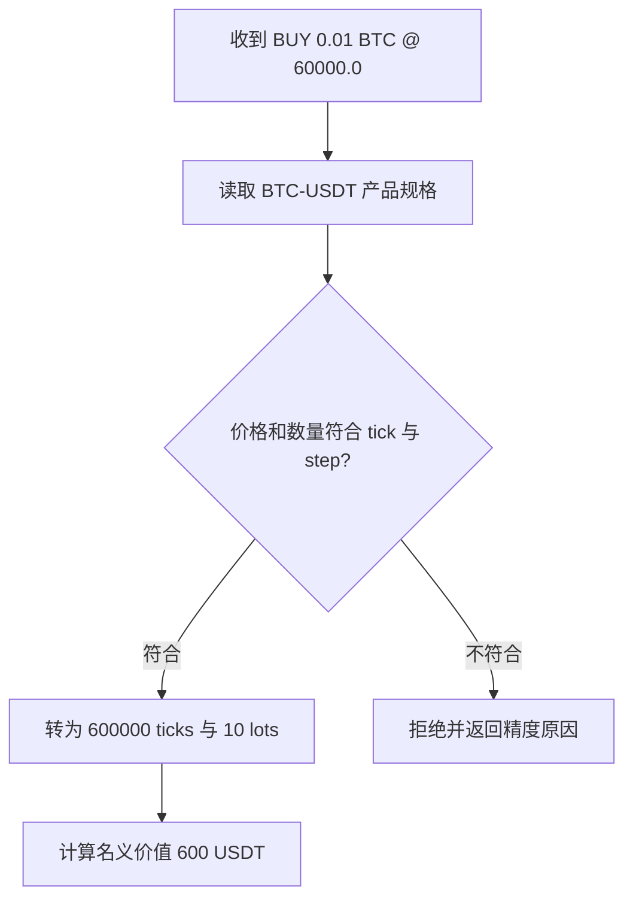

# 问题：下单数量“1”是什么单位？

两名工程师都提交 `BUY 1 BTCUSDT`。一个人把它理解为买入 1 BTC 的名义敞口（**notional exposure**），另一个人把它理解为买入 1 张合约。即使两个人输入完全相同，若合约面值不同，风险敞口也不同。

在设计 API 或撮合（**matching**）之前，系统必须先知道合约规格（**contract specifications**），以及订单（**order**）里的数量、价格、名义价值（**notional value**）、结算币（**settlement currency**）和盈亏（**P&L**）单位各自是什么意思。

# 尝试：把不同合约都当成“数量 × 价格”

线性合约看起来可以用 `数量 × 价格` 得出名义价值；反向合约的合约张数可能代表固定报价币面值，名义价值不随价格同样变化。若用浮点数表示价格和数量，还可能出现无法整除最小价格刻度或数量步长的问题。

# 发现：合约是带规格的交易对象

合约规格至少要描述：

- 标的、报价币、结算币；
- 线性或反向计价方式；
- 合约乘数/面值、数量单位；
- 价格 tick、数量 step、最小数量/最小名义价值；
- 有无到期日、交割/结算规则；
- 当前状态（可交易、仅减仓、结算中、下线等）；
- 对应的保证金档位、费用、价格限制和资金费率规则的版本。

这不是静态配置。交易所公开接口允许用户查询合约规格；Bybit 的 instruments-info 包含 tick size、qty step、最小名义价值、结算币、到期时间、资金费间隔等字段，且文档提醒部分数量限制会定期调整。[Bybit Instruments Info](https://bybit-exchange.github.io/docs/v5/market/instrument) OKX 的 instruments 接口区分 `ctType`、`ctVal`、`tickSz` 和 `lotSz`。[OKX API v5](https://app.okx.com/docs-v5/en/)

# 先拆成两个问题

合约的**计价方式**和**是否到期**是两个不同维度：

| 维度 | 选项 | 系统新增的问题 |
|---|---|---|
| 计价方式 | 线性 / 反向 | 名义价值、盈亏、保证金和结算币怎样计算？ |
| 生命周期 | 永续 / 有到期日 | 永续如何锚定现货？交割合约到期时怎样结算/下线？ |

因此“永续”不等于某一种盈亏公式，“反向”也不意味着必须永续。产品组合要以具体交易所的在售规格为准。

# 推导一个教学模型

以下只是帮助推理的简化定义，不代替交易所规则。忽略手续费、资金费、滑点、保证金和舍入。

## 例子一：先把数量和价格放回单位里

选一个线性（**linear**）BTC-USDT 永续合约（**perpetual contract**）：数量单位是 BTC，价格单位是 USDT/BTC，结算币是 USDT。Alice 买入 `0.01 BTC`，价格为 `60,000 USDT/BTC`：

1. 数量乘以价格：`0.01 BTC × 60,000 USDT/BTC`。
2. BTC 单位约掉，得到名义价值 `600 USDT`。
3. 若价格上涨到 `61,000 USDT/BTC` 后平仓，毛盈亏为 `0.01 × (61,000 - 60,000) = 10 USDT`。

现在把产品规格换成“每张代表 `0.001 BTC`”的合约。同样输入 `qty=1`，名义标的数量就变成 `0.001 BTC`，而不是 `1 BTC`。所以系统不能在读规格前解释 `qty`。

**线性合约假设**：数量 `q` 表示标的币数量，价格 `P` 的单位是报价币/标的币。名义价值为 \(N=qP\) 报价币。以价格 \(P_0\) 开多、价格变为 \(P_1\) 时，毛盈亏为 \(\mathrm{PnL}=q(P_1-P_0)\) 报价币。

**反向合约（inverse contract）教学假设**：每张合约面值（**contract value**）`V` 报价币，持有 `n` 张。名义面值 `n × V` 不随价格改变；以标的币结算时，简化的多头盈亏可写作 \(nV(1/P_0-1/P_1)\)。因倒数价格的单位是标的币/报价币，结果单位为标的币。真实交易所的方向、面值及结算约定必须逐产品核验。

这一步只算经济含义，还没判断订单能不能进入系统。下一步把产品的最小价格和数量刻度加回来。

# 工程结论：用整数刻度表达订单

## 例子二：加入价格 tick 和数量 step

沿用同一产品，设价格刻度（**tick size**）`tickSize = 0.1 USDT/BTC`、数量步长（**quantity step / lot size**）`qtyStep = 0.001 BTC`：

1. `60,000.0` 可以整除 `0.1`，转换为 `600,000 ticks`；`60,000.05` 不能整除，应拒绝或按产品规则处理，不能静默四舍五入。
2. `0.01 BTC` 可以整除 `0.001 BTC`，转换为 `10 lots`；`0.0015 BTC` 不能整除，应拒绝。
3. 只有刻度校验通过，系统才用规格明确的整数值继续算名义价值、比较价格和撮合数量。



输入适配层把十进制字符串解析到整数单位，拒绝无法整除的值。这样比较价格、扣减数量时不依赖二进制浮点近似。

还要给规格变化建版本。订单被接受时记录采用的合约规格版本；价格限制、数量范围或面值变化时，已挂订单如何处理必须由规则明确定义，不能让热更新悄悄改变旧单语义。

# 实验

## 连续校验：精度正确还不够

给本节线性产品增加一条教学规则：最小名义价值（**minimum notional value**）为 `100 USDT`。仍以 BTC 计数量，`tickSize=0.1`、`qtyStep=0.001`，价格取 `60,000.1`。先判断下面四笔请求；每笔只在前一道检查通过后进入下一道。

<details>
<summary>展开校验记录</summary>

| 请求 | 价格刻度 | 数量步长 | 名义价值 | 结果 |
|---|---|---|---:|---|
| `0.001 @ 60,000.05` | 不符合 | — | — | 拒绝价格刻度 |
| `0.0015 @ 60,000.1` | 符合 | 不符合 | — | 拒绝数量步长 |
| `0.001 @ 60,000.1` | 符合 | 符合 | 60.0001 USDT | 拒绝最小名义价值 |
| `0.002 @ 60,000.1` | 符合 | 符合 | 120.0002 USDT | 通过本节三项规格检查 |

最后一行仍需后续账户风险与准入检查。通过产品规格校验，只证明输入能按该产品规则解释，不代表保证金足够或一定成交。

</details>


### 规格变了，旧订单的整数还代表什么？

假设订单 O-17 按 `spec-v17` 接受，价格 `60,000.1` 存为 `600,001 ticks`。之后新规格 v18 把 tick 改为 `0.5`。先预测：能否用 v18 的刻度直接解读旧整数？

<details>
<summary>展开版本推演</summary>

```text
旧解释：600,001 × 0.1 = 60,000.1 USDT/BTC
误用新刻度：600,001 × 0.5 = 300,000.5 USDT/BTC
新请求按 v18 检查：60,000.1 / 0.5 = 120,000.2，不是整数
```

价格的整数值必须连同刻度、单位与规则版本保存，或采用固定存储单位并单独记录规则。不能把“都是整数”当成跨版本语义一致。

本教学策略约定：新请求采用 v18，旧挂单保留 v17 的价格语义直到成交或撤销。另一种产品策略可能统一撤销不再合规的旧单。必须先规定迁移策略，再执行热更新；保存版本本身不能替代迁移决策。

</details>

完成[规格卡与单位换算实验](lab.md)，把同一组订单分别放进线性币数量和合约张数两种规格中，逐步验证单位、刻度与名义价值。

# 新问题

知道了交易对象的含义，还不知道一次“下单成功”究竟保证了什么。网络超时、部分成交和撤单竞争使得命令与最终结果分离。下一章从订单生命周期开始。

# 掌握检查

- **回忆**：tick、step、合约面值、结算币分别描述什么？
- **推导**：用 `0.01 BTC @ 60,000 USDT/BTC` 推出名义价值和价格上涨 1,000 USDT/BTC 时的线性毛盈亏，并检查单位。
- **应用**：把规格改为 `ctVal=0.001 BTC/张`、`qtyStep=1 张`，判断 `qty=3` 的标的数量；再把 tick 改为 0.5，重新判断 `60,000.1` 是否有效。
- **重建**：不看正文，从“同一个 qty=1 可能代表不同敞口”推导出为什么规格版本必须参与 API 校验、撮合单位和账本复算。
