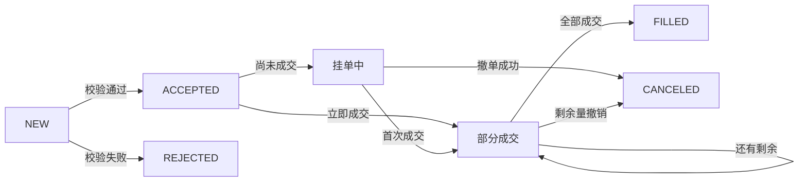

# 问题

Alice 发送一个 BTC-USDT 买入限价单：价格 60,000，数量 0.01。接口返回“成功”。她立刻断网，回来后看到这笔单已经成交了一部分。这个“成功”到底表示什么？

先不要设计服务。请写下你认为系统至少要能回答的五个问题：订单是否被接收、是否挂簿、成交了多少、还能撤多少、账户扣了什么。

# 尝试

设想 API 只返回 `{ "success": true }`。用户超时后重试，系统可能创建第二张单；如果响应在撮合后丢失，客户端不知道订单是否已经成交。先列出所有可能的时间顺序：请求到达、校验、接受、撮合、持久化、响应丢失、客户端重试。

# 旧办法的边界

“HTTP 200 就是订单完成”把命令接收和业务结果混为一谈。订单可能被拒绝、立即完全成交、部分成交后继续挂单、部分成交后取消，或在取消与成交竞争时先成交一部分。网络超时也不能证明服务端没处理请求。

# 发现：把订单当作状态变化，而不是一次函数调用

定义一个最小生命周期：

## 例子：从请求到最终状态，按时间走一遍

Alice 提交 `BUY 0.01 @ 60,000`。先假设卖盘没有可成交价格：

1. 服务校验规格、精度和风险，创建唯一 `order_id`，状态进入 `ACCEPTED`。
2. 委托进入订单簿，状态成为活动挂单；API 返回的是已接受，不是已成交。
3. 稍后卖方成交 `0.004 BTC`，订单变为部分成交，剩余量是 `0.006 BTC`。
4. 若 Alice 的客户端超时并用相同幂等键重试，系统应返回原订单结果，而不是再创建一张 `0.01 BTC` 委托。
5. 后续撤单确认只阻止剩余 `0.006 BTC` 继续成交；已发生的 `0.004 BTC` 成交仍是有效事实。

每一步都能用数量守恒检查：`0.01 = 0.004 + 0.006`。幂等键处理重复命令，成交 ID 处理重复成交；两者解决的是不同问题。

这只是教学模型。具体交易所的状态名、终态规则和事件字段以对应 API 文档为准。核心观察是：**响应确认请求被接收，不等价于成交确认**。Bybit 明确说明创建订单响应是异步接受确认，应通过 WebSocket 确认订单状态；OKX 的订单频道首次订阅不推存量快照，只推新订单或更新；Binance 在 2026 年公告中将 USDⓈ-M WebSocket 路由拆分为 public、market、private 类别。它们的细节不同，但都提醒我们：客户端确认、状态查询和异步事件必须分别建模。[Bybit 下单接口](https://bybit-exchange.github.io/docs/v5/order/create-order) · [OKX API 文档](https://app.okx.com/docs-v5/en/) · [Binance USDⓈ-M WS 升级公告](https://www.binance.com/en/support/announcement/detail/ebf9b0aa9eca4ff3804eef6fb09ba32a)

# 概念：命令、状态和事实

- **命令**：用户要求系统做什么，例如创建/撤销委托。
- **状态**：此刻订单累计成交量、剩余量、当前状态。
- **事实/事件**：已发生且不可改写的业务变化，例如订单接受、成交、撤单。
- **确认**：API 对命令接收/校验的答复；不是对后续撮合结果的预言。

订单可以有客户端幂等标识。服务端在定义的作用域内将重复创建请求映射到同一订单结果。幂等键不能替代成交 ID，也不能让两个独立服务各自“猜”订单最终状态。

# 推导

订单量 `q`、累计成交量 `z`、剩余量 `r` 应满足：`q = z + r`，且 `0 ≤ z ≤ q`。每笔成交要有稳定唯一标识；订单状态可由成交累计量和终态事件导出或校验。撤单确认后，未来不得再对该订单产生新成交，但撤单之前已发生的成交仍然有效。

“先持久化还是先发撮合”不是一句口号能定的。实现必须定义崩溃点：若撮合发生但成交事实没落盘，重启可能丢成交；若只记录命令未记录撮合结果，重放必须能确定性地重建结果。后续章节会逐步加上日志、事务边界和恢复协议。

# 实验

打开 [委托状态纸面模拟](lab.md)，在“响应丢失后重试”“撤单与成交竞争”两种时序下更新状态表。对每条路径检查数量守恒与重复请求。

# 新问题

如果订单被接受后仍未成交，系统要把它放在哪里？当一个新买单跨过卖盘价格时，如何决定它先和谁成交、剩余部分是否挂簿？下一章从订单簿压力推导撮合规则。

对照三家交易所公开接口的差异，可查看[公开行为观察](../../docs/exchange-behavior.md)。

# 掌握检查

- **回忆**：命令、接受确认、订单状态和 Fill 事实各自回答什么问题？
- **推导**：订单量 `0.01`，先成交 `0.004` 再撤销剩余量，写出数量守恒与终态。
- **应用**：API 接受响应丢失，客户端用相同幂等键重试；说明应返回什么，并说明为何成交去重还需要另一个 ID。
- **重建**：画出“命令—确认—状态—事件”，从网络超时推导查询、幂等和异步推送为何都需要存在。
