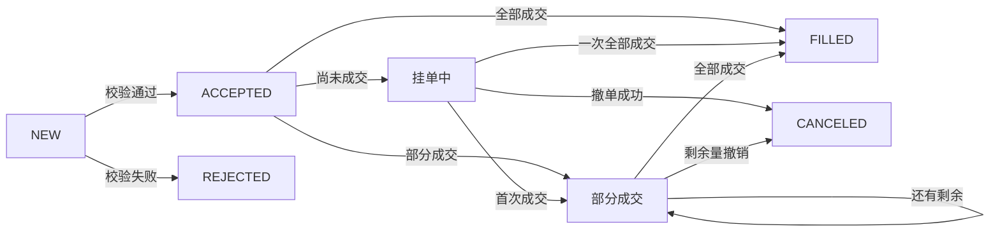
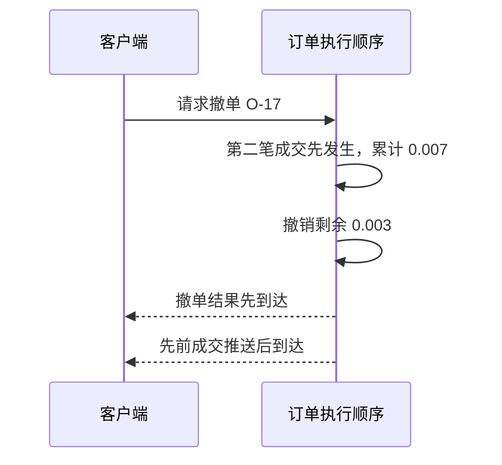

## 问题

Alice 发送一个 BTC-USDT 买入限价单（**limit order**）：价格 60,000，数量 0.01。接口返回“成功”确认（**acknowledgment, ACK**）。她立刻断网，回来后看到这笔单已经部分成交（**partially filled**）。这个“成功”到底表示什么？

先不要设计服务。请写下你认为系统至少要能回答的五个问题：订单是否被接收、是否挂簿、成交了多少、还能撤多少、账户扣了什么。

## 尝试

设想 API 只返回 `{ "success": true }`。用户超时后重试，系统可能创建第二张单；如果响应在撮合后丢失，客户端不知道订单是否已经成交。先列出所有可能的时间顺序：请求到达、校验、接受、撮合、持久化、响应丢失、客户端重试。

## 旧办法的边界

“HTTP 200 就是订单完成”把命令接收和业务结果混为一谈。订单可能被拒绝、立即完全成交、部分成交后继续挂单、部分成交后取消，或在取消与成交竞争时先成交一部分。网络超时也不能证明服务端没处理请求。

## 发现：把订单当作状态变化，而不是一次函数调用

订单生命周期（**order lifecycle**）需要区分命令（**command**）、状态（**state/status**）与事件（**event**），不能把一次 API 调用当成最终结果。

定义一个最小生命周期：

### 例子：从请求到最终状态，按时间走一遍

Alice 提交 `BUY 0.01 @ 60,000`。先假设卖盘没有可成交价格：

1. 服务校验规格、精度和风险，创建唯一 `order_id`，状态进入 `ACCEPTED`。
2. 委托进入订单簿，状态成为活动挂单；API 返回的是已接受，不是已成交。
3. 稍后卖方成交 `0.004 BTC`，订单变为部分成交，剩余量是 `0.006 BTC`。
4. 若 Alice 的客户端超时并用相同幂等键重试，系统应返回原订单结果，而不是再创建一张 `0.01 BTC` 委托。
5. 后续撤单确认只阻止剩余 `0.006 BTC` 继续成交；已发生的 `0.004 BTC` 成交仍是有效事实。

每一步都能用数量守恒（**quantity conservation**）检查：`0.01 = 0.004 + 0.006`。幂等键（**idempotency key**）处理重复命令，成交 ID（**fill ID / execution ID**）处理重复成交；两者解决的是不同问题。

撤单确认后，上面的 `0.006` 是已撤销的未成交数量，不再是活动挂单余量。教学模型可记录“原始数量＝累计成交＋活动余量＋已撤销/过期数量”；真实 API 对终态剩余字段的定义需要单独读取。

这只是教学模型。具体交易所的状态名、终态规则和事件字段以对应 API 文档为准。核心观察是：**响应确认请求被接收，不等价于成交确认**。Bybit 明确说明创建订单响应是异步接受确认，应通过 WebSocket 确认订单状态；OKX 的订单频道首次订阅不推存量快照，只推新订单或更新；Binance 在 2026 年公告中将 USDⓈ-M WebSocket 路由拆分为 public、market、private 类别。它们的细节不同，但都提醒我们：客户端确认、状态查询和异步事件必须分别建模。[Bybit 下单接口](https://bybit-exchange.github.io/docs/v5/order/create-order) · [OKX API 文档](https://app.okx.com/docs-v5/en/) · [Binance USDⓈ-M WS 升级公告](https://www.binance.com/en/support/announcement/detail/ebf9b0aa9eca4ff3804eef6fb09ba32a)

## 概念：命令、状态和事实

- **命令**：用户要求系统做什么，例如创建/撤销委托。
- **状态**：此刻订单累计成交量、剩余量、当前状态。
- **事实/事件**：已发生且不可改写的业务变化，例如订单接受、成交、撤单。
- **确认**：API 对命令接收/校验的答复；不是对后续撮合结果的预言。

订单可以有客户端幂等标识。服务端在定义的作用域内将重复创建请求映射到同一订单结果。幂等键不能替代成交 ID，也不能让两个独立服务各自“猜”订单最终状态。

## 推导

把数量分成原始数量 `q`、累计成交量 `z`、活动余量 `l`、已撤销/过期数量 `c`，本教学模型满足 `q=z+l+c`，各项非负。若把“未成交总量”定义为 `r=l+c`，也可写 `q=z+r`；它不能和“仍可撮合余量”混用。每笔成交要有稳定唯一标识；订单状态可由成交累计量和终态事件导出或校验。服务端确认撤单生效后，不应再撮合该订单余量；先前已发生的成交仍可能晚于撤单响应才到达客户端。

“先持久化还是先发撮合”不是一句口号能定的。实现必须定义崩溃点：若撮合发生但成交事实没落盘，重启可能丢成交；若只记录命令未记录撮合结果，重放必须能确定性地重建结果。后续章节会逐步加上日志、事务边界和恢复协议。

## 实验

### 三次重试，究竟创建几张订单？

本节明确约定一个教学接口：创建操作以 `(account_id, client_order_id)` 为幂等键，在规定保留期内保存原请求参数摘要和操作结果。这是我们设计的接口契约，不能假设所有交易所的 client order ID 都提供同样保证。

Alice 用 `K-17` 创建 `BUY 0.01 @ 60,000`，服务器接受为 O-17，响应在网络中丢失。先预测下面三种重试的效果：

展开命令身份检查

| 重试 | 本模型处理结果 | 为什么 |
|---|---|---|
| K-17，原参数不变 | 返回原操作关联的 O-17 | 重试同一命令 |
| K-17，数量改为 0.02 | 拒绝幂等键参数冲突 | 同一身份不能代表两个操作 |
| K-18，数量仍为 0.01 | 按新命令校验，可能创建另一张单 | 新身份无法证明是重试 |

若 O-17 已经部分成交，原创建操作的 ACK 与 O-17 的当前状态仍是两种查询结果。接口可以一并返回，但必须标明各自语义；重放原成功答复不能让订单状态退回“尚未成交”。

#### 撤单与第二笔成交，谁先发生？

O-17 先成交 `0.004`，客户端随后发撤单。在本教学模型中，撮合分区为相关订单动作提供确定顺序。以下两条路径都可能发生，取决于服务端生效顺序：

| 服务端顺序 | 累计成交 z | 活动余量 l | 已撤销量 c | 最终仓位增加量 |
|---|---:|---:|---:|---:|
| 撤销余量先生效，后续撮合不能再使用该余量 | 0.004 | 0 | 0.006 | 0.004 BTC |
| 第二笔先成交 0.003，再撤销余量 | 0.007 | 0 | 0.003 | 0.007 BTC |

两行都满足 `0.01=z+l+c`。点击撤单的客户端时间、网络消息到达时间与撮合分区的生效顺序并不相同。

本模型的撤单结果携带订单版本和累计数量。客户端根据对象版本或协议允许的权威查询合并状态；它仍按唯一成交 ID 记录迟到的有效 Fill，但不能用更旧的订单快照覆盖较新终态。真实 API 若没有可比较版本，需要按其查询与推送契约恢复。

打开 [委托状态纸面模拟](lab.md)，在“响应丢失后重试”“撤单与成交竞争”两种时序下更新状态表。对每条路径检查数量守恒与重复请求。

## 新问题

如果订单被接受后仍未成交，系统要把它放在哪里？当一个新买单跨过卖盘价格时，如何决定它先和谁成交、剩余部分是否挂簿？下一章从订单簿压力推导撮合规则。

对照三家交易所公开接口的差异，可查看[公开行为观察](../../docs/exchange-behavior.md)。

## 掌握检查

- **回忆**：命令、接受确认、订单状态和 Fill 事实各自回答什么问题？
- **推导**：订单量 `0.01`，先成交 `0.004` 再撤销剩余量，写出数量守恒与终态。
- **应用**：API 接受响应丢失，客户端用相同幂等键重试；说明应返回什么，并说明为何成交去重还需要另一个 ID。
- **重建**：画出“命令—确认—状态—事件”，从网络超时推导查询、幂等和异步推送为何都需要存在。

### 本章资料与模型边界

资料复核日期：2026-10-05。公开资料的适用产品、账户模式及地区以链接页面为准；正文内部流程为教学参考设计。实验参数是自造数据，账务与风险公式按本章假设使用。复核范围与全书版本见[定稿说明](../../docs/release/)。
