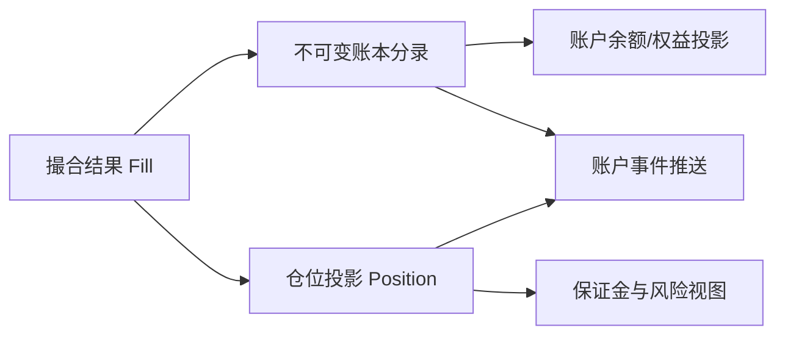

# 问题

Alice 的 BTC-USDT 线性永续限价单成交了 0.01 BTC，成交价 60,000 USDT。撮合服务已经完成，但 Alice 断网，服务端的账户更新事件又被重放了一次。

系统要回答三个不同问题：交易事实是什么？Alice 的钱包权益变化了多少？她现在持有多少仓位？把这三者都塞进一个“订单状态”字段，无法说明哪一部分是事实，哪一部分是计算结果。

# 尝试：只保存当前余额

如果账户表里只存 `wallet_balance = 1,010`，我们不知道这 10 USDT 来自平仓盈亏、资金费、转账还是重复记账。余额快照方便查询，却不够审计，也无法可靠地在故障后复建。

反过来，如果每次收到消息都直接 `balance += delta`，重复消息就会把同一笔钱加两次。消息系统提供的投递语义不能替代业务幂等。

# 发现：把事实与投影拆开

- **Fill（成交事实）**：哪两个订单在什么合约规格下，以什么价量成交。成交发生后不应被“修改成另一笔成交”；错误需通过冲正或补偿事实处理。
- **账本分录**：资产变化的可审计记录，例如交易费、已实现盈亏、资金费、转账。每条记录要追溯来源事件和业务类型。
- **仓位（Position）**：按账户、产品、仓位方向聚合后的当前敞口，是可以从成交与结算事实重算的投影。
- **账户快照**：为查询加速的余额/权益结果，不应取代权威分录。

这些是参考架构概念。具体交易所的账务分类和记账账户属于其内部会计设计，不由公开交易 API 完全披露。

# 用一个例子区分“保证金”和“本金”

教学假设：Alice 从 1,000 USDT 钱包余额开始；线性合约数量按 BTC 计；开多 `0.01 BTC @ 60,000`，随后平仓 `0.01 BTC @ 61,000`；忽略手续费、资金费和滑点。初始保证金按 10% 示意。

开仓名义价值为 `0.01 × 60,000 = 600 USDT`。按示意规则，系统需要为风险管理保留 60 USDT 的保证金空间。但这不等于把 600 USDT 从 Alice 钱包转给卖方：衍生品仓位通常记录敞口，保证金是可用权益的占用/约束，具体资产记账依产品规则而定。

平仓毛盈亏：

\[\begin{aligned}
\mathrm{PnL} &= \text{数量}\times(\text{平仓价}-\text{开仓价})\\
&=0.01\times(61{,}000-60{,}000)\\
&=10\ \mathrm{USDT}
\end{aligned}\]

忽略费用后，平仓释放持仓占用，钱包权益从 1,000 USDT 变成 1,010 USDT。若 Alice 的对手方是 Bob，Bob 在同一简化模型中的毛盈亏应为 -10 USDT；若由平台作为记账对手，则需有对应的清算/对手方科目。实际账务是否逐笔平衡、如何处理保险基金等，需要交易所规则与会计设计支持，不能仅靠这个教学例子断言。

# 参考账本记录

在“一笔成交触发双方分录”的教学模型中，分录可有如下字段：

| 字段 | 目的 |
|---|---|
| `journal_id` | 一次原子记账批次的唯一 ID |
| `source_type`, `source_id` | 来源类别和唯一事实 ID，例如 `FILL`, `trade_id` |
| `account_id`, `asset` | 影响哪个账户的哪种资产 |
| `entry_type` | `REALIZED_PNL`、`FEE`、`FUNDING`、`TRANSFER` 等语义 |
| `amount` | 定点数值和方向；不要用无约束二进制浮点 |
| `spec_version`, `fee_version` | 复算所需的合约与费率版本 |
| `created_at`, `sequence` | 发生/入账时间及可检测顺序缺口的序号 |

同一个 `trade_id` 会影响不同账户，所以幂等键通常不能简单只用 `trade_id`。教学模型可以用 `(trade_id, account_id, entry_type, asset)` 唯一约束；若一笔交易会为同一账户、同一类型产生多行，还要加入 line index 或 posting id。幂等键应反映业务唯一性，而不是随便挑一个数据库主键。

# 账本不变量

1. 每笔成交 ID 对每个规定的记账用途最多入账一次。
2. 账本分录追加写；更正通过冲正/补偿分录表达，不覆盖历史。
3. 在需要守恒的业务边界内，按资产核对分录和；费用收入、保险基金、清算对手等要有明确定义的接收账户。
4. 仓位数量能由已处理成交、平仓、结算事实按顺序重新构建。
5. 账户推送只能在事实持久化之后发出；推送丢失可重新查询或从带序号的事件恢复。
6. 账户投影必须能与权威账本按已知版本/序号对账。

# 实验

完成 [成交与账本实验](lab.md)：先不记账地计算 Alice/Bob 的仓位，再加入毛盈亏和重复事件；随后比较账户余额、可用余额、仓位和未实现盈亏，不要把它们合并为一个数。

# 新问题：仓位存在后，何时拒绝下一张单？

一个钱包里有现存仓位、活动委托和可用余额。成交记录能说明过去发生了什么，却不能单独回答“如果新单立即成交，亏损扩大时资金够不够”。下一章从潜在风险敞口推导下单前保证金检查。

# 掌握检查

- **回忆**：Fill、账本分录、仓位投影和余额快照分别是什么？
- **推导**：Alice `0.01 BTC @ 60,000` 开仓、`0.01 BTC @ 61,000` 平仓，忽略费用，计算毛盈亏和示意保证金占用。
- **应用**：同一 Fill 因重试被消费两次，写出幂等作用域；说明如何纠正一笔已提交但金额错误的分录。
- **重建**：从“消息可重复、状态要可恢复”推导不可变事实、追加分录、可重建仓位投影和账户对账之间的关系。
