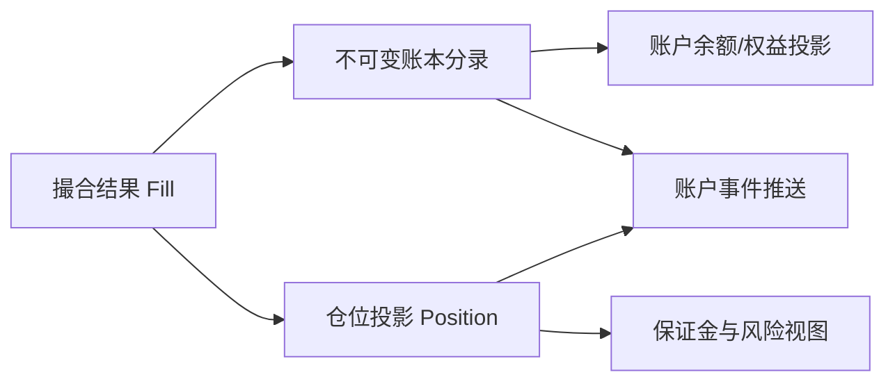
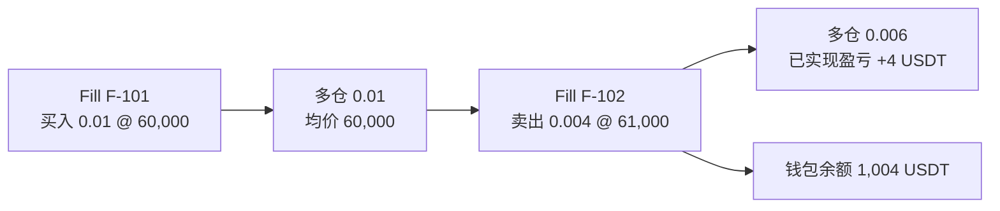

## 问题

Alice 的 BTC-USDT 线性永续限价单成交了 0.01 BTC，成交价 60,000 USDT。撮合服务已经完成，但 Alice 断网，服务端的账户更新事件（**account update event**）又被重放（**replayed**）了一次。

系统要回答三个不同问题：交易事实是什么？Alice 的钱包余额与风险权益分别变化了多少？她现在持有多少仓位？把这三者都塞进一个“订单状态”字段，无法说明哪一部分是事实，哪一部分是计算结果。

## 尝试：只保存当前余额

如果账户表里只存 `wallet_balance = 1,010`，我们不知道这 10 USDT 来自平仓盈亏、资金费、转账还是重复记账。余额快照方便查询，却不够审计，也无法可靠地在故障后复建。

反过来，如果每次收到消息都直接 `balance += delta`，重复消息就会把同一笔钱加两次。消息系统提供的投递语义不能替代业务幂等。

## 发现：把事实与投影拆开



- **成交事实（fill / execution）**：哪两个订单在什么合约规格下，以什么价量成交。成交发生后不应被“修改成另一笔成交”；错误需通过冲正或补偿事实处理。
- **账本分录（ledger entry / posting）**：资产变化的可审计记录，例如交易费、已实现盈亏、资金费、转账。每条记录要追溯来源事件和业务类型。
- **仓位投影（position projection）**：按账户、产品、仓位方向聚合后的当前敞口，是可以从成交与结算事实重算的视图。
- **账户快照（account snapshot）**：为查询加速的余额/权益结果，不应取代权威分录。

这些是参考架构概念。具体交易所的账务分类和记账账户属于其内部会计设计，不由公开交易 API 完全披露。

## 用一个例子区分“保证金”和“本金”

教学假设：Alice 从 1,000 USDT 钱包余额开始；线性合约数量按 BTC 计；开多 `0.01 BTC @ 60,000`，随后平仓 `0.01 BTC @ 61,000`；忽略手续费、资金费和滑点。初始保证金（**initial margin, IM**）按 10% 示意。

开仓名义价值为 `0.01 × 60,000 = 600 USDT`。按示意规则，系统需要为风险管理保留 60 USDT 的保证金（**margin**）空间。但这不等于把 600 USDT 从 Alice 钱包转给卖方：衍生品仓位通常记录敞口，保证金是可用权益的占用/约束，具体资产记账依产品规则而定。

平仓毛盈亏：

\[\begin{aligned}
\mathrm{PnL} &= \text{数量}\times(\text{平仓价}-\text{开仓价})\\
&=0.01\times(61{,}000-60{,}000)\\
&=10\ \mathrm{USDT}
\end{aligned}\]

忽略费用后，平仓释放持仓占用，钱包余额从 1,000 USDT 变成 1,010 USDT。若 Bob 与 Alice 同时开仓并在相同价量同时平仓，Bob 在同一简化模型中的毛盈亏应为 -10 USDT；若由平台作为记账对手，则需有对应的清算/对手方科目。实际账务是否逐笔平衡、如何处理保险基金等，需要交易所规则与会计设计支持，不能仅靠这个教学例子断言。

## 跟着两笔成交逐步更新

现在把完整平仓拆成两笔 Fill，观察每一步哪些状态改变。继续使用线性合约，Alice 初始钱包余额为 `1,000 USDT`；忽略手续费、资金费和滑点。初始保证金率 `10%` 只用于说明风险预留，不表示成交时把名义价值转给对手方。



### 第一步：开仓成交

Fill `F-101` 表示买入 `0.01 BTC @ 60,000`。先暂停：这笔成交是否意味着钱包要向卖方支付 `600 USDT`？

<details>
<summary>展开计算</summary>

不是。在本章的永续合约教学模型里，`600 USDT` 是名义敞口，不是买入并交割 `0.01 BTC` 的现货付款。开仓后的状态为：

| 状态 | 成交前 | 应用 F-101 后 |
|---|---:|---:|
| 钱包余额 | 1,000 USDT | 1,000 USDT |
| 多仓数量 | 0 BTC | 0.01 BTC |
| 开仓均价 | — | 60,000 USDT/BTC |
| 已实现盈亏 | 0 USDT | 0 USDT |
| 持仓保证金占用（示意） | 0 USDT | 60 USDT |

仓位投影由 Fill 更新；保证金预留是风险视图，不是成交金额。这里尚未发生平仓，所以没有已实现盈亏。

</details>

### 第二步：只平掉一部分

随后 Fill `F-102` 表示卖出 `0.004 BTC @ 61,000`。先预测两个数：这笔平仓实现多少盈亏？完成后还剩多少仓位？

<details>
<summary>展开计算</summary>

被平掉的数量乘以平仓价与原开仓均价之差：

```text
已实现盈亏 = 0.004 × (61,000 - 60,000) = +4 USDT
剩余多仓   = 0.01 - 0.004 = 0.006 BTC
```

在忽略费用的前提下，钱包余额变为 `1,004 USDT`，剩余 `0.006 BTC` 的开仓均价仍为 `60,000 USDT/BTC`。成交的名义价值 `0.004 × 61,000 = 244 USDT` 不是从钱包转出的本金；风险服务应根据剩余仓位和当前规则重新计算预留。

</details>

### 第三步：同一成交又送达一次

账本服务已经处理 `F-102`，但确认消息丢失。消息代理重投了相同 Fill。若处理器再次执行“钱包加 4、仓位减 0.004”，结果就会变成错误的 `1,008 USDT` 和 `0.002 BTC`。

处理器应以稳定的成交 ID 和业务作用域判断它是否已处理，并让“记录已处理 ID”与相应账务/投影更新处于同一可靠提交边界。重投时返回已处理结果或安全空操作；不能依赖消息只投递一次。若账本、仓位投影分属不同服务，则它们各自维护消费水位和幂等记录，并通过 Fill ID、序号及对账收敛，不能假设跨服务更新天然原子。

因此，处理完重复消息后仍应满足：钱包 `1,004 USDT`、多仓 `0.006 BTC`、均价 `60,000 USDT/BTC`、该 Fill 对应的已实现盈亏只入账 `+4 USDT`。

## 从多笔成交恢复仓位，而非只保存一个均价

本节采用单向持仓模式（**one-way position mode**）：同产品买卖先净额抵消。双向持仓模式（**hedge mode**）则要将多、空仓位作用域分开；不能仅凭 SELL 判断它是在平多还是开空。

继续从多仓 `0.006 @ 60,000` 开始，再买 `0.004 @ 62,000`。先预测：新的均价是两个价格的简单平均吗？

<details><summary>展开加仓、平仓与反向开仓</summary>

线性合约按标的数量加权：`(0.006×60,000+0.004×62,000)/0.010=60,800`。新增买入没有本模型的已实现盈亏。

若随后卖出 `0.012 @ 61,000`，先平掉 `0.010` 多仓，已实现 `0.010×(61,000-60,800)=+2 USDT`；超出的 `0.002` 成为新空仓，入场价 61,000。本例普通单允许反向开仓；只减仓（reduce-only）订单不能让超出部分成为新空仓。

仅减仓而不反向开仓时，剩余仓位均价不变。反向合约和具有周期结算的产品要按自己的均价/重置规则实现，不能套用本节线性公式。

</details>

保存各笔原始价量或充分的累计成本数据，用规定精度计算，而不是把展示舍入后的均价反复用于下一笔结算。

## 将交易费用也放回同一账本

换回本章完整开平仓例子：买入 `0.01 @ 60,000`，随后卖出 `0.01 @ 61,000`。假设这两次均为 taker，教学费率为 `0.05%=0.0005`，费用由平台费用账户接收，先自行计算净损益。

<details><summary>展开手续费分录</summary>

| 事件 | 计算 | Alice 钱包 / USDT |
|---|---|---:|
| 初始 | — | 1,000 |
| 开仓成交费 | `600×0.0005=0.3` | 999.7 |
| 平仓实现盈亏 | `0.01×1,000=10` | 1,009.7 |
| 平仓成交费 | `610×0.0005=0.305` | 1,009.395 |

净损益为 `10-0.3-0.305=9.395 USDT`。每笔费用批次中 Alice 的负分录与费用账户的正分录相抵；盈亏结算和费用结算使用不同 posting type，避免去重键把合法费用误判为重复盈亏。

</details>

真实费率按用户等级、产品、maker/taker 角色、活动与时间版本确定；费用币种、负费率返佣和舍入也要记录。风险检查中的手续费缓冲只是未扣款预留，实际扣费后要转换/释放该预留，不能两次扣同一费用。

## 参考账本记录

在“一笔成交触发双方分录”的教学模型中，分录可有如下字段：

| 字段 | 目的 |
|---|---|
| `journal_id` | 一次原子记账批次的唯一 ID |
| `source_type`, `source_id` | 来源类别和唯一事实 ID，例如 `FILL`, `trade_id` |
| `account_id`, `asset` | 影响哪个账户的哪种资产 |
| `entry_type` | `REALIZED_PNL`、`FEE`、`FUNDING`、`TRANSFER` 等语义 |
| `amount` | 定点数值和方向；不要用无约束二进制浮点 |
| `spec_version`, `fee_version` | 复算所需的合约与费率版本 |
| `created_at`, `sequence` | 发生/入账时间及可检测顺序缺口的序号 |

同一个 `trade_id` 会影响不同账户，所以幂等键通常不能简单只用 `trade_id`。教学模型可以用 `(trade_id, account_id, entry_type, asset)` 唯一约束；若一笔交易会为同一账户、同一类型产生多行，还要加入 line index 或 posting id。幂等键应反映业务唯一性，而不是随便挑一个数据库主键。

## 账本不变量

1. 每笔成交 ID 对每个规定的记账用途最多入账一次。
2. 账本分录追加写；更正通过冲正/补偿分录表达，不覆盖历史。
3. 在需要守恒的业务边界内，按资产核对分录和；费用收入、保险基金、清算对手等要有明确定义的接收账户。
4. 仓位数量能由已处理成交、平仓、结算事实按顺序重新构建。
5. 账户推送只能在事实持久化之后发出；推送丢失可重新查询或从带序号的事件恢复。
6. 账户投影必须能与权威账本按已知版本/序号对账。

## 实验

完成 [成交与账本实验](lab.md)：先不记账地计算 Alice/Bob 的仓位，再加入毛盈亏和重复事件；随后比较账户余额、可用余额、仓位和未实现盈亏，不要把它们合并为一个数。

## 新问题：仓位存在后，何时拒绝下一张单？

一个钱包里有现存仓位、活动委托和可用余额。成交记录能说明过去发生了什么，却不能单独回答“如果新单立即成交，亏损扩大时资金够不够”。下一章从潜在风险敞口推导下单前保证金检查。

## 掌握检查

- **回忆**：Fill、账本分录、仓位投影和余额快照分别是什么？
- **推导**：Alice `0.01 BTC @ 60,000` 开仓、`0.01 BTC @ 61,000` 平仓，忽略费用，计算毛盈亏和示意保证金占用。
- **应用**：同一 Fill 因重试被消费两次，写出幂等作用域；说明如何纠正一笔已提交但金额错误的分录。
- **重建**：从“消息可重复、状态要可恢复”推导不可变事实、追加分录、可重建仓位投影和账户对账之间的关系。


### 本章资料与模型边界

资料复核日期：2026-10-05。公开资料的适用产品、账户模式及地区以链接页面为准；正文内部流程为教学参考设计。实验参数是自造数据，账务与风险公式按本章假设使用。复核范围与全书版本见[定稿说明](../../docs/release/)。
