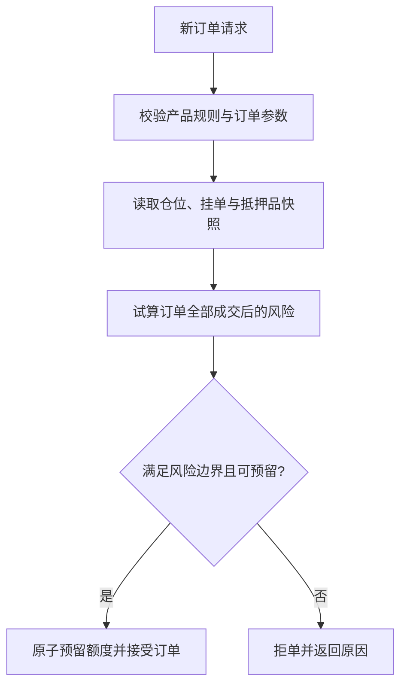
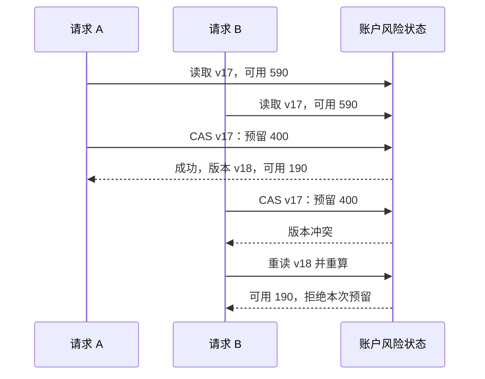

# 问题：同一笔订单，单看钱包余额够不够？

Alice 钱包里有 1,000 USDT，已经持有 BTC 永续仓位，也有两张尚未成交的挂单。她再提交一张新单。即使钱包余额为正，如果这张新单全部成交，账户能否承担价格波动和维持保证金要求？

“余额大于零”只回答账面资产问题，不回答潜在仓位风险问题。

# 尝试：把设置的杠杆当成风险结果

常见粗略想法是：名义价值除以杠杆（**leverage**）就是保证金。例如 10 倍杠杆，1,000 USDT 能开 10,000 USDT 仓位。这个估算忽略了已有仓位、挂单预留、手续费、风险档位（**risk tier**）、抵押品折扣（**collateral haircut**）、全仓共享盈亏和组合抵消。

杠杆更像用户请求或产品配置，系统能否接受仍由当前仓位、风险限额和产品规则共同决定。Bybit 的公开接口把最大仓位价值与风险限额关联；OKX 账户字段则区分权益、初始保证金、维持保证金和挂单冻结额度。[Bybit Set Leverage](https://bybit-exchange.github.io/docs/v5/position/leverage) · [Bybit Risk Limit](https://bybit-exchange.github.io/docs/v5/market/risk-limit) · [OKX API v5 Account](https://app.okx.com/docs-v5/en/)

# 发现：下单检查是在判断“成交后的世界”

新订单可能立刻全部/部分成交，也可能成为活动挂单。一个保守的单账户流程可按以下顺序思考：

1. 验证交易对象当前可交易，并解析本订单采用的合约规格版本。
2. 校验价格、数量、精度、最小名义价值、下单方向、持仓模式及 reduce-only 等约束。
3. 计算该订单若成交，对仓位、初始保证金和手续费缓冲的影响。
4. 同时考虑现有仓位、已有挂单和本账户风险模式；挂单未成交也可能需要占用风险额度。
5. 在同一风险作用域内原子预留所需额度。成功才接受，否则返回可解释拒因。

最后一步是容易漏掉的并发压力：两个 API 请求同时读取 1,000 USDT 可用额度，各自都认为只需要 700 USDT。如果都通过而没有原子预留，总占用达到 1,400，系统就超卖了风险额度。必须让风险检查与额度预留形成线性化边界，或使用等价的乐观并发控制并可靠重试。



# 算例：两张单同时争用同一额度

把“账户可用额度”当成教学用的单一风险预算，暂不讨论组合抵消和风险档位。Alice 有 `1,000 USDT` 钱包权益；已有仓位占用 `250 USDT`，两张未成交订单合计预留 `150 USDT`，手续费缓冲 `10 USDT`。先算新订单可以竞争的余量：

```text
可用风险额度 = 1,000 - 250 - 150 - 10 = 590 USDT
```

接着，两个不同产品的订单几乎同时到达，每张都需要额外预留 `400 USDT`。先想一想：逐张单独看，它们是否都能通过 `590 USDT` 的检查？如果都通过，最终预留会是多少？

<details>
<summary>展开逐步推演</summary>

单独看任意一张，`400 ≤ 590`，所以两次独立检查都会通过。但两张合计需要 `800 USDT`，超出可用预算 `210 USDT`。问题不在乘法，而在两次检查读到同一份旧状态。

| 时点 | 请求 A | 请求 B | 可用风险额度 |
|---|---|---|---:|
| 初始快照 `v17` | 尚未预留 | 尚未预留 | 590 USDT |
| 并发读取 | 读到 `v17`：需要 400，通过 | 读到 `v17`：需要 400，通过 | 两边都误以为有 590 |
| A 原子提交 | 预留 400，账户版本变为 `v18` | 仍持有旧快照 | 190 USDT |
| B 校验版本 | — | 发现不是 `v17`，重新读取并重算 | 190 USDT |
| 最终决定 | 接受 | `400 > 190`，拒绝或要求缩小订单 | 不低于 0 |

可用额度检查与预留必须有一个线性化提交点。数据库事务、账户串行队列或版本号 CAS 都可以承担这个职责；采用哪种实现，取决于风险状态存放位置与吞吐要求。版本冲突意味着重读并重算，不是把旧的“通过”结果直接重试写入。

</details>



这个算例把预留视为固定金额，便于看清竞态。真实全仓或组合风险下，候选订单可能改变净敞口、风险档位和抵押品折扣；系统应在账户最新版本上重算**整体组合风险**，不能只把两个独立的静态金额相加。

# 建立一个可推导的简化模型

先只讨论逐仓保证金（**isolated margin**）、线性合约、单一币种、固定维持保证金率（**maintenance margin rate**），忽略费用、资金费、风险档位和舍入。设多头数量 `q`、开仓价 `P₀`、当前标记价 `P`、逐仓保证金 `M`、维持保证金率 `r`：

\[\begin{aligned}
U(P) &= q(P-P_0) \\
E(P) &= M+U(P) \\
MM(P) &= qPr \\
E(P)&\le MM(P)\quad\text{时触发本模型的风险处置}
\end{aligned}\]

这个模型用来推导概念，不是任一交易所的通用强平公式。产品可能加入维持保证金分档、维持保证金扣减项、强平费用预留、资金费、币种折扣和更复杂的账户级计算。必须按产品文档逐项补齐。

## 算一遍

设 `q=0.01 BTC`、`P₀=60,000 USDT/BTC`、`M=100 USDT`、`r=0.5%`。在当前标记价 `P=55,000` 时：

```text
U = 0.01 × (55,000 - 60,000) = -50 USDT
E = 100 - 50 = 50 USDT
MM = 0.01 × 55,000 × 0.005 = 2.75 USDT
```

在本简化模型下尚高于维持保证金（**maintenance margin, MM**）要求。解临界价格 `E(P)=MM(P)`：

```text
100 + 0.01 × (P - 60,000) = 0.01 × P × 0.005
P ≈ 50,251.26 USDT/BTC
```

解方程的过程比记住某个固定公式更重要：权益随着价格下降，维持要求也随名义价值变化。真实系统还需要明确使用什么价格源、何时刷新、舍入往哪边保守，以及多个仓位/抵押品怎样聚合。

# 账户模式改变风险边界

逐仓保证金（**isolated margin**）把一定保证金分配到特定持仓；全仓保证金（**cross margin**）通常在较大的账户范围共享抵押品与盈亏；组合保证金（**portfolio margin**）还可能根据组合风险估算资金要求。它们会改变“哪些资产共同承担风险”和“什么数值触发处置”，因此保证金模式应是账户状态，不是只在订单请求里出现的一次性参数。

公开接口能观察到这些模式的外部差异，但不能直接揭示内部算法。OKX 文档明确把 `adjEq`、`mmr` 与风险率关联；Bybit 对组合保证金模式可不提供单一仓位的清算价字段。上述差异说明单个“预估强平价”并非任何账户模式都能代表完整风险状态。[OKX Account API](https://app.okx.com/docs-v5/en/) · [Bybit Position WebSocket](https://bybit-exchange.github.io/docs/v5/websocket/private/position)

# 实验

完成 [保证金与并发预留实验](lab.md)。先用固定维持率解逐仓临界价，再让两张并发订单竞争同一可用余额，观察只做“先读后写”会出现什么结果。

# 新问题：风险计算用哪个价格？

如果保证金依赖市价，而市价被一笔小成交短暂拉歪，正常仓位也可能被错误判断；如果价格更新太慢，真实风险又会被低估。下一章需要拆分最后成交价、指数价、标记价和资金费率的作用。

# 掌握检查

- **回忆**：初始保证金、维持保证金、可用余额和杠杆配置各自表达什么？
- **推导**：用本章 `q=0.01`、开仓价 `60,000`、保证金 `100`、维持率 `0.5%` 的简化模型，验证 `P=55,000` 时是否触发风险边界。
- **应用**：两个订单并发读取同一笔 `1,000 USDT` 可用额度，各自需要 `700 USDT`；设计能阻止总预留超过额度的原子边界。
- **重建**：从“新委托可能立刻全部成交”推导账户快照范围、活动挂单占用、风险试算、原子预留与可解释拒单。
