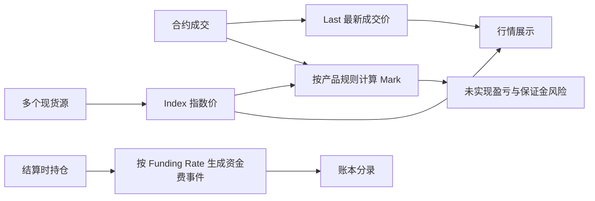
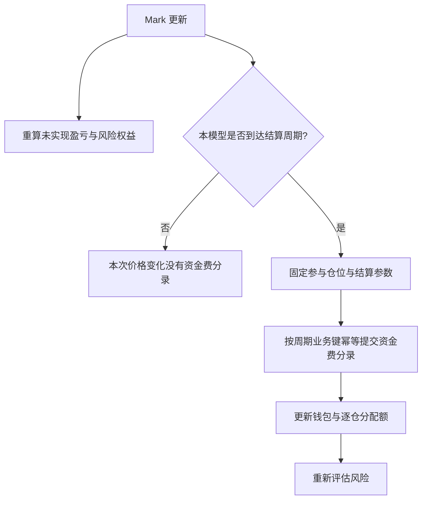

# 问题：盘口里一笔小成交，能让整个账户被强平吗？

假设 BTC 现货指数在 60,000 附近稳定，某永续市场盘口很薄，一笔小卖单让最后成交价瞬间跌到 55,000，又立刻回到 59,900。如果未实现盈亏和强平只看最后成交价，仓位可能在一个短暂局部成交上被判定为失去保证金。

反过来，如果只看外部现货指数，合约市场自己的真实持续下跌又可能被忽略。系统需要多个价格角色，而不是一个“正确价格”。

# 发现：价格名称背后是不同问题

- **最新成交价（last traded price, Last）**：本交易市场最近一笔成交的价格。它描述近期成交，但容易受局部深度和瞬时成交影响。
- **指数价（index price, Index）**：按产品定义从外部现货市场构造的参考值，降低依赖单一合约簿的风险。成分来源、权重、剔除异常值和过期处理属于产品规则。
- **标记价（mark price, Mark）**：为未实现盈亏、保证金或强平判断构造的风险参考价格。它可能组合指数价、合约基差（**basis**）、时间衰减或其他规则；公式不应跨交易所照搬。

Bybit 的公开说明将 Mark 用于未实现盈亏和强平触发；其构造结合现货指数和合约基差相关数据。[Bybit Mark Price Calculation](https://www.bybit.com/en/help-center/article/?id=000001117) OKX 对其 X-Perps 页面分别说明 Last、Index、Mark 的不同用途，但页面明确产品适用范围可能有限。[OKX Price References](https://www.okx.com/en-us/help/okx-x-perps-eea-mark-last-index-price)

# 从问题推到参考价格链路

先沿着数据走一遍：现货源计算指数，指数与合约市场数据按产品规则生成标记价；Last 仍单独描述最近成交。之后风险服务读取 Mark，资金费则只在结算时变成账本事件。

内部教学架构可以把价格处理分成几步：

1. 收集每个外部现货源的报价与时间戳。
2. 归一化币对、单位和精度；按产品配置检测过期、偏差异常和断流。
3. 依声明的权重/过滤规则计算指数价，并保留输入来源与计算版本，便于审计重放。
4. 根据合约市场价格和基差规则计算标记价。
5. 将 Last、Index、Mark 分别推送给行情订阅者，并由风险服务按产品规则读取指定价格。
6. 数据质量降级时触发明确定义的保护策略：暂停新仓、限制只减仓、切换备用源或冻结风险动作；策略必须结合产品规则设计，不能猜测某交易所具体行为。

这段是参考设计，不是对 Binance、Bybit 或 OKX 内部价格服务拓扑的描述。关键不变量是：每个价格值都带有价格类型、产品、时间戳/序号、计算版本和质量状态，不能把不同价格在字段名里都叫 `price`。



# 资金费率为何出现？

永续合约没有到期日，因此不能只靠到期交割迫使其价格收敛。资金费率（**funding rate**）提供周期性多空持仓者之间的资金转移，用来推动永续价格向现货参考靠拢。方向与计算必须看该产品的费率定义；不少线性永续在正费率时由多方向空方支付，但不得将这个约定推广到未核验的产品。

教学模型只讨论线性合约：

\[\begin{aligned}
\mathrm{FundingFee} &= \text{结算时仓位名义价值}\times\text{FundingRate}\\
\text{名义价值} &= \text{仓位数量}\times\text{结算所用参考价格}
\end{aligned}\]

示例：持有 `0.01 BTC`，结算 mark 为 `60,500 USDT/BTC`，资金费率 `+0.01%`，则名义价值为 `605 USDT`，费用大小为 `605 × 0.0001 = 0.0605 USDT`。在本例设定的正向约定下，多头支付 0.0605 USDT，空头收到同额。

真实系统还须明确：资金费率如何算出、费率上限/下限、结算间隔、结算时参与持仓的判定、使用价格和舍入方式、资金不足时扣哪里。Bybit 和 OKX 的公开资料都说明费率间隔可按产品或市场状况变化；应把结算 interval 当作合约规则数据，而不是硬编码为固定 8 小时。[Bybit Funding Fee](https://www.bybit.com/en/help-center/article/Funding-fee-calculation) · [OKX Perpetual Funding Mechanism](https://www.okx.com/en-us/help/perps-funding-fee-mechanism) · [Binance USDⓈ-M Funding Rates](https://www.binance.com/en/support/faq/detail/360033525031)

# 把价格变动和资金结算分开记

标记价变化会更新未实现盈亏和风险视图，但不一定立刻产生钱包账本分录。资金费在结算时才形成明确的账户转移事件。把每一秒的 mark 变化都当作资金转账，会混淆估值和实际结算；把资金费只显示在 UI 上又会让账户权益无法复算。

资金费结算事件建议记录：产品 ID、结算周期 ID、费率、仓位快照/结算数量、结算价、费率版本、参与时间边界及实际分录。重复结算必须由稳定的周期 ID 与账户/仓位作用域幂等。

# 实验

## 沿同一仓位走四个时刻

Alice 钱包余额（**wallet balance**）为 `1,000 USDT`，持有 `0.01 BTC` 多仓，入场价 `60,000`。本算例从钱包中划出 `40 USDT` 作为逐仓保证金 `M`；这笔划分不额外扣减钱包总额。使用第 5 章的简化维持保证金模型 `MM=qPr`，维持率 `r=0.5%`，风险按 Mark 判断。忽略交易手续费、舍入和其他仓位。

价格是预先给定的教学数据，下面不尝试从 Index 推算某家交易所的 Mark：

| 时刻 | Last | Index | Mark | 发生的事情 |
|---|---:|---:|---:|---|
| t0 | 60,000 | 60,000 | 60,000 | 建立仓位 |
| t1 | 55,000 | 60,020 | 59,980 | 局部成交短暂偏离 |
| t2 | 59,900 | 60,010 | 59,990 | 本模型在此结算资金费 |
| t3 | 58,000 | 58,500 | 58,300 | 三种价格都出现持续下跌 |

### 第一步：一笔小成交改变了什么？

t1 的 Last 跌到 `55,000`，Mark 却是 `59,980`。先预测：把两种价格分别代入同一公式，得到的逐仓权益是否相同？钱包会不会因此发生转账？

<details>
<summary>展开计算与状态变化</summary>

```text
若错误地以 Last 估值：
UPL = 0.01 × (55,000 - 60,000) = -50 USDT
E   = 40 - 50 = -10 USDT
MM  = 0.01 × 55,000 × 0.005 = 2.75 USDT

按本模型约定的 Mark 估值：
UPL = 0.01 × (59,980 - 60,000) = -0.2 USDT
E   = 40 - 0.2 = 39.8 USDT
MM  = 0.01 × 59,980 × 0.005 = 2.999 USDT
```

第一组会满足 `E ≤ MM`，第二组仍有 `39.8 > 2.999`。差异来自输入价格角色，公式完全相同。此时没有平仓或资金结算，钱包余额仍为 `1,000 USDT`；变化的是未实现盈亏和风险视图。

</details>

### 第二步：资金费结算真的改变余额

t2 的 Mark 为 `59,990`，结算费率为 `+0.01%`。本模型约定正费率时多头支付空头，并从 Alice 分配的逐仓保证金中扣除；它同时减少钱包余额。先算名义价值，再算费用，最后更新权益，避免把费率直接乘保证金。

<details>
<summary>展开结算步骤</summary>

```text
结算名义价值 = 0.01 × 59,990 = 599.9 USDT
资金费支出   = 599.9 × 0.0001 = 0.05999 USDT
钱包余额     = 1,000 - 0.05999 = 999.94001 USDT
逐仓保证金 M = 40 - 0.05999 = 39.94001 USDT
Mark 未实现盈亏 = 0.01 × (59,990 - 60,000) = -0.1 USDT
逐仓权益 E   = 39.94001 - 0.1 = 39.84001 USDT
```

钱包余额和逐仓分配额各自展示同一笔扣款对不同视图的影响，不能再将两项变化相加扣第二遍。剩余未分配钱包部分仍为 `960 USDT`。真实产品从何处扣款、何种账户余额参与风险，要按对应规则实现。

资金费形成可追溯分录；Mark 变化形成估值更新。若同一资金费结算周期再次投递，本模型以产品、周期、账户和仓位作用域去重，以上余额不再扣第二次。

</details>



### 第三步：Mark 也会下跌

t3 的 Mark 降到 `58,300`。沿用结算后的 `M=39.94001`，先自行计算，再展开答案。

<details>
<summary>展开风险复算</summary>

```text
UPL = 0.01 × (58,300 - 60,000) = -17 USDT
E   = 39.94001 - 17 = 22.94001 USDT
MM  = 0.01 × 58,300 × 0.005 = 2.915 USDT
```

本时刻仍有 `E > MM`。Mark 是规则定义的风险价格，也需要随市场变化；它不保证仓位安全。钱包余额仍为 `999.94001`，因为本步只有价格变化，没有新的结算。

</details>

现在尝试重建三条边界：哪些消息只改变价格和估值？哪些事件产生资产分录？风险服务应该在什么版本的余额、仓位和价格上重新计算？

完成 [价格与资金费实验](lab.md)：同一时刻放入 Last、Index、Mark 三条序列，观察 UPL 和风险触发差异，再加入周期 funding 事件。

# 新问题：风险线被触及时，如何把仓位缩下来？

标记价使风险判断更稳健，却不能替账户承担亏损。权益达到维持保证金边界时，风险系统需要发起减仓/强平，并面对盘口深度不足与潜在缺口。下一章从强平工作流推导保险基金和损失处理。

# 掌握检查

- **回忆**：Last、Index、Mark 分别描述什么？资金费和未实现盈亏分别何时影响账户？
- **推导**：持有 `0.01 BTC`，Mark 为 `60,500`，Funding Rate 为 `+0.01%`；计算名义价值和费用大小，并按本章方向约定说明多空收付。
- **应用**：某外部指数源过期，而 Last 突然偏离其他来源；列出价格质量状态、风险服务允许的动作和需要保留的审计字段。
- **重建**：从永续没有自然到期日推导资金费动机，再推导多价格职责、标记价格质量治理、未实现估值与周期账本结算的边界。
