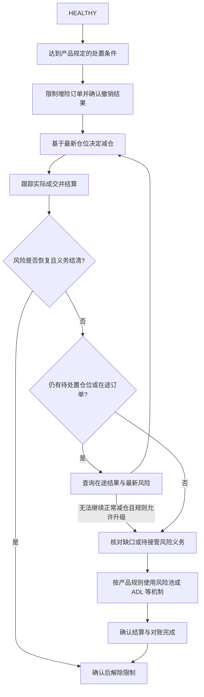
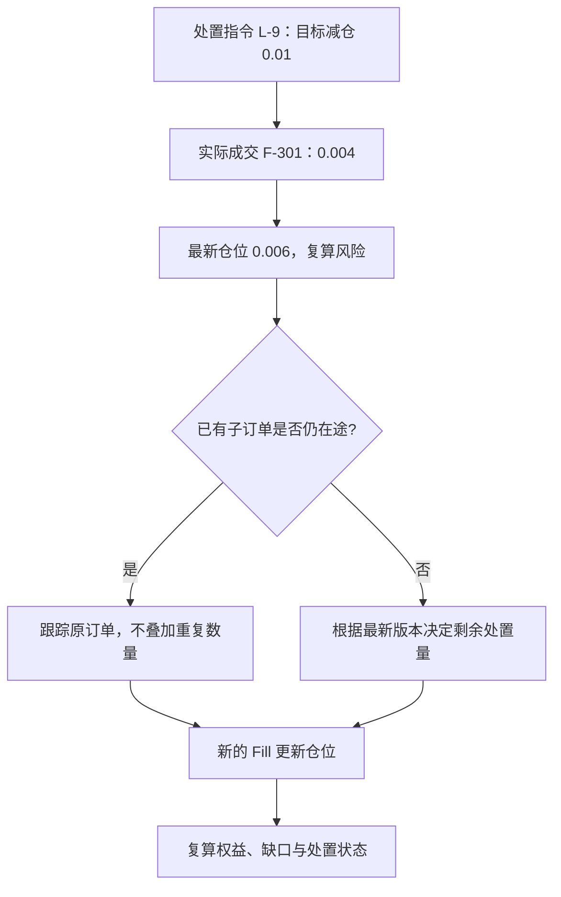

## 问题：保证金线被触及时，系统要做什么？

风险引擎（**risk engine**）发现仓位权益接近维持要求。它不能只把仓位状态改成 `LIQUIDATED`：市场里还存在真实订单簿、挂单竞争、滑点（**slippage**）、费用和可能的资产缺口。必须明确触发、减险、成交、结算、缺口处理和账户恢复是一条工作流。

## 尝试：在强平价直接“卖出”

强平触发价、破产价和市场实际成交价是不同概念：

- **触发条件/触发价（liquidation trigger / trigger price）**：系统判断需要接管或减仓的风险边界，可能按 mark 或账户维持保证金率判定。
- **破产价（bankruptcy price）**：简化理解为仓位保证金被耗尽的参考价格，具体定义随合约和账户模式变化。
- **执行价（execution price）**：强平单在当时市场中实际成交的价格，受到深度和滑点影响。

假设多仓标记价触发强平价为 65,000 USDT，破产价为 64,000 USDT，而实际平仓在 64,980 成交。以简化线性模型看，执行价好于破产价，可能留下可回收剩余；若只能在 63,950 成交，则实际亏损越过破产价，需要某种缺口处理。真实交易所的结算、费用、分摊及清算规则需查产品条款。

Bybit 的公开保险基金（**insurance fund**）说明将实际执行价与破产价的差额作为基金增减来源之一；Binance 说明保险基金用于覆盖破产仓位破产价与执行价之间的差额。它们都说明强平价不等于保证成交价。[Bybit Insurance Fund](https://www.bybit.com/en/help-center/article/Insurance-Fund) · [Binance Futures Insurance Funds](https://www.binance.com/en/support/faq/detail/360033525371)

## 发现：强平是状态机，不是一次价格计算

用以下状态作为教学模型：



若市场无法继续成交，规则可以要求风险池接管或升级到 ADL；这仍需记录待处置仓位与资产义务，不能假装已平仓。重试应有期限、退避和升级策略，不能无限循环发同一数量。

这个状态机不是所有交易所的流程照搬。它暴露出必须回答的工程问题：

- 预警和正式接管的风险阈值是否相同？
- 先取消哪些挂单，撤单和成交竞争时如何确定最终订单状态？
- 采取部分减仓还是整仓平仓？
- 若清算订单部分成交、被拒或市场断流，如何重试和防止重复平仓？
- 执行亏损大于仓位可承担范围时，谁接收缺口？
- 风险改善后，系统如何确认解除限制？

Bybit 对较高风险档位描述了分层清算；其 UTA 清算规则也列举先取消增加风险的订单等保护动作。Binance 的保险基金资料描述基金能力不足时会启动 ADL。规则和适用范围各异，工程模型不能把某一交易所状态机当作行业统一标准。[Bybit Risk Limit](https://www.bybit.com/en/help-center/article/Risk-Limit-Perpetual-and-Expiry-Contracts) · [Bybit UTA Liquidation Process](https://www.bybit.com/en/help-center/article/UTA-Trading-Rules-Liquidation-Process) · [Binance ADL](https://www.binance.com/en-AE/support/faq/detail/360033525471)

### 市场成交与客户结算也可能不同

Bybit 的保险基金说明还区分了市场实际执行与客户按破产价结算。不能从“市场执行价决定基金差额”推断客户的钱包必然直接按每笔执行价结算。本章连续算例选择“实际成交损益加独立缺口补偿”的教学记账方式，旨在展示可恢复边界；接入真实产品时必须另外实现客户结算价、风险池接管与费用规则。[Bybit Insurance Fund](https://www.bybit.com/en/help-center/article/Insurance-Fund)

## 参考架构：把风险决策和成交执行解耦

风险服务产生带账户版本和触发依据的处置指令；执行服务将其转成可被撮合的减仓/强平订单；撮合输出照常成为 Fill；账本结算执行损益，仓位投影再反馈到风险服务。风险服务不能凭“发单请求已成功”就认为仓位已减少。

每条处置指令有稳定的 `liquidation_id`、账户/仓位范围、原因、决策时风险快照和策略版本。执行结果要以实际成交和账户更新为准；重复指令必须幂等。如果执行失败或仓位已由用户自行减小，系统需要重新评估当前状态，而不是盲目重复旧数量。

## 缺口阶梯：保险基金与 ADL

一个通用教学模型可以按如下顺序表达损失归属：

1. 从强平仓位的可用保证金/权益承担损失；
2. 执行优于破产价的剩余金额进入对应风险池或按规则处理；
3. 执行劣于破产价形成的缺口由保险基金或规则指定资金承担；
4. 若基金不能覆盖，可能对盈利对手仓位执行自动减仓（**auto-deleveraging, ADL**）或其他产品规定的损失分配。

这只是通用压力链，并不意味着各交易所一定采用完全相同的层级、池化方式、排序或触发条件。Bybit 和 Binance 的公开说明都将 ADL 关联到保险基金无法吸收的特定亏损，但详细筛选规则不同，必须单独核对。[Bybit Insurance Fund / ADL](https://www.bybit.com/en/help-center/article/Insurance-Fund) · [Binance Insurance Funds](https://www.binance.com/en/support/faq/detail/360033525371)

## 实验

### 连续算例：强平只成交了一部分

本节设 Alice 先买入 `0.004 BTC @ 59,999`，再买入 `0.006 BTC @ 60,000`。按数量加权，形成 `0.01 BTC` 多仓，均价 `59,999.6`；本节逐仓保证金设为 `60 USDT`。固定维持率 `0.5%`，忽略手续费、资金费、舍入和风险档位。本模型把平仓已实现亏损从逐仓分配额扣除，剩余仓位继续按 Mark 估值。

#### 第一步：确认触发依据

Mark 为 `54,000` 时，未实现盈亏为 `-59.996 USDT`，逐仓权益为 `0.004 USDT`，维持要求为 `2.7 USDT`。因此进入风险处置。先预测：发出 `SELL 0.01` 后，能否立即把仓位记成零？

<details>
<summary>查看第一笔实际成交后的复算</summary>

不能。市场只成交 `0.004 BTC @ 54,020`，成交 ID 为 `F-301`：

```text
已实现盈亏 = 0.004 × (54,020 - 59,999.6) = -23.9184 USDT
剩余仓位   = 0.01 - 0.004 = 0.006 BTC
剩余逐仓分配额 = 60 - 23.9184 = 36.0816 USDT
```

若 Mark 仍为 `54,000`，剩余仓位未实现盈亏为 `-35.9976`，权益为 `0.084`，维持要求为 `1.62 USDT`。风险仍未恢复。服务必须根据实际 Fill 更新仓位后继续评估，不能根据发单数量宣布处置完成。

</details>

#### 第二步：处理旧命令与新事实的竞争

原强平命令要求处理 `0.01 BTC`，现在剩余可减数量只有 `0.006 BTC`。重复收到原命令时，执行服务应查找已有处置及子订单（**child order**），确认已成交、仍在途（**in-flight**）和已取消的数量。若已有子订单还有 `0.006` 在途，直接再发一个 `0.006` 会制造重复减仓。

只有确认旧子订单剩余量已终止，或通过原订单继续执行，才能进入下一步。用户减仓与强平也应共享仓位版本和只减仓约束，避免两个执行者同时消耗同一剩余仓位。



#### 第三步：按最终成交结算缺口

假设剩余 `0.006 BTC` 最终以 `53,900` 成交，ID 为 `F-302`。先算第二笔盈亏，再汇总两笔；不要用触发时 Mark 代替执行价。

<details>
<summary>查看结算结果</summary>

```text
第二笔盈亏 = 0.006 × (53,900 - 59,999.6) = -36.5976 USDT
总已实现盈亏 = -23.9184 - 36.5976 = -60.516 USDT
本模型缺口 = 60.516 - 60 = 0.516 USDT
最终仓位 = 0 BTC
```

保险基金是否承担、怎样入账，是缺口处置规则。本例假设相应风险池承担 `0.516 USDT`；该分录应引用稳定的处置 ID 和结算批次，重复处置不能再扣一次基金。若本例 Alice 初始钱包为 1,000 USDT，两笔实际亏损后钱包为 939.484、逐仓剩余为 -0.516；风险池补偿 +0.516 后，钱包为 940、逐仓剩余为 0，对应风险池分录为 -0.516 USDT。该教学补偿只结清超出逐仓资金的义务，不赔回用户已承担的 60 USDT 亏损。

原始简化破产价为 `59,999.6 - 60/0.01 = 53,999.6`。第一笔成交后，剩余仓位的零权益参考价变为 `59,999.6 - 36.0816/0.006 = 53,986`。这说明破产参考也必须结合已实现结算和剩余仓位重算。

</details>

数量归零证明市场减仓完成；账本提交、缺口归属确定和解除限制仍需各自确认。下一章就在 F-302 入账后注入一次崩溃，检验这条路径能否恢复。

完成 [强平与保险基金实验](lab.md)：比较实际执行价好于/差于破产价的结果，并在每个状态插入超时、重复指令和部分成交。

## 新问题：恢复之后的账户状态可靠吗？

一笔强平可能跨风险服务、撮合、账本、保险基金和推送多个状态边界。系统崩溃后，只有日志、幂等和对账才能证明风险处置到底走到哪一步。下一章从故障恢复开始。

## 掌握检查

- **回忆**：触发价/触发条件、破产价和执行价分别是什么？
- **推导**：强平仓位保证金为 60 USDT，简化实际亏损为 60.496 USDT，算出缺口并说明它不是“触发价”的函数。
- **应用**：强平请求已发出但只部分成交，期间用户又提交减仓单；说明风险服务如何基于新仓位版本避免重复平掉旧数量。
- **重建**：画出从风险判断、限制挂单、强平执行、成交结算到缺口处置的状态路径；区分服务命令与成交事实。


### 本章资料与模型边界

资料复核日期：2026-10-05。公开资料的适用产品、账户模式及地区以链接页面为准；正文内部流程为教学参考设计。实验参数是自造数据，账务与风险公式按本章假设使用。复核范围与全书版本见[定稿说明](../../docs/release/)。
