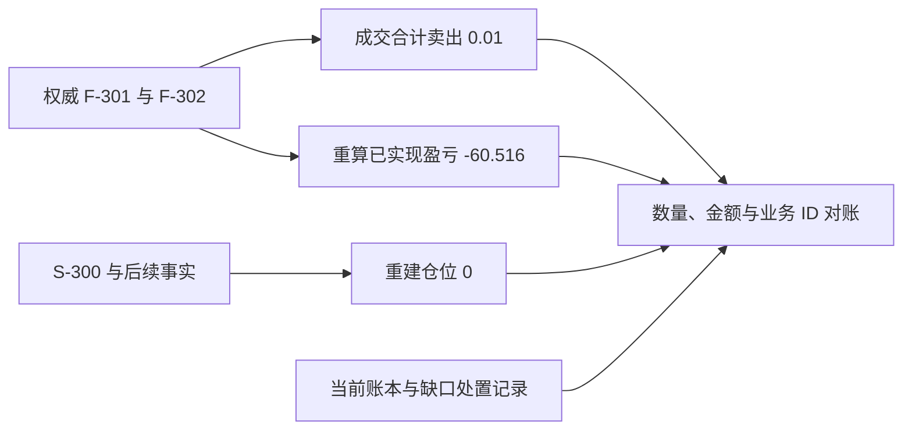

# 问题：成交已经发生，账户还没更新，进程就崩了

撮合服务产出一笔成交事实（**fill**），消息已经进入异步通道；账户账本服务提交了一部分记录后崩溃。重启后，系统需要决定：继续处理、回滚还是人工介入？如果重放同一成交，如何防止重复加仓？

这是交易系统最关键的正确性问题之一：在线流程看起来顺畅，不等于故障后仍可恢复。

# 尝试：从数据库当前值继续跑

如果只读订单当前状态、账户余额和仓位快照，系统可能无法分辨：

- 订单尚未撮合，还是已撮合但结果未记录？
- Fill 已落盘，还是只有消息代理收到消息？
- 账本已经提交但确认消息丢失，还是账本根本没写？
- 两个服务的快照是否来自同一逻辑时点？

因此恢复需要权威事实、明确序号和可验证的检查点，而不是猜测“哪张表比较新”。

# 发现：命令、事实、投影必须有恢复边界

定义一个简化链路：


每一跳都要知道输入事实的唯一 ID、处理到哪个序号，以及重复处理能否安全。状态投影（**projection**）允许丢弃并重建；已提交的业务事实不能因为重启而消失或被静默改写。按事实恢复称为重放（**replay**），保存某个序号上的状态副本称为快照（**snapshot**）。

# 故障矩阵

| 崩溃位置 | 恢复问题 | 参考处理思路 |
|---|---|---|
| 接受订单前 | 客户端超时，不知道服务端是否收到了命令 | 客户端以同一幂等键重试；服务端查询或返回原结果 |
| 接受事实写入后、撮合前 | 订单是否应该继续进入撮合？ | 将命令/接受记录和撮合队列恢复位置关联起来；避免丢单 |
| 撮合过程中 | 订单簿和成交顺序能否重现？ | 按每个撮合分区的持久化顺序恢复；确定性重放必须固定规则/规格版本 |
| Fill 已持久化、账本未提交 | 账户是否漏记？ | 账本消费端从最后确认序号续读；按 `fill_id + account + posting` 幂等 |
| 账本已提交、确认事件未发 | 是否会重复记账？ | 账本事务内写入事务发件箱（**transactional outbox**），发布可重试；消费者仍按业务键去重 |
| 账户推送丢失 | 用户视图是否过期？ | 提供可查询快照/游标恢复；推送事件包含序号或版本 |

这里的事件日志、outbox、分区序号是参考解决方案，不代表 Binance、Bybit、OKX 公开了内部采用这些机制。

# 快照为什么仍有用？

全量重放所有订单和成交会越来越慢。系统可以周期性保存订单簿、账户或仓位的快照，并记录快照涵盖到的日志序号。恢复时校验快照元数据，再从其后的日志继续应用。

快照要定义生成边界：

- snapshot ID、产品/账户分区、schema 版本；
- 最后应用序号与时间；
- 所引用的合约规格、风控规则和撮合规则版本；
- 校验和、文件完整性与可用副本；
- 与其他状态快照之间是否需要同一逻辑水位。

对于撮合核心，若规则代码变化后重放旧命令可能得到不同结果，日志必须保留足够的已发生事实，或者显式保留旧规则解释路径；不能把“拿最新代码重跑历史命令”当作天然确定性。

# 重放与对账不是一回事

- **重放（replay）**：根据已记录事实恢复某个投影。
- **对账（reconciliation）**：比较两个独立视角，发现遗漏、重复、金额差异或序号差。

例如从成交事实重建仓位后，与账户服务当前持仓核对；从账本重算钱包，再与余额快照核对；订单累计成交量与 Fill 总量也应一致。对账结果要可定位到产品、账户、币种和事件 ID，不能只发一个“总余额不匹配”告警。

# 实验

## 连续算例：第二笔强平成交入账后崩溃

沿用第 7 章的 `F-301` 与 `F-302`。为方便手算，本例为 Alice 的账户消费流分配序号 `301`、`302`；它不表示真实 API 提供跨市场全局连续序号。快照 `S-300` 保存强平前的多仓 `0.01 BTC`、均价 `59,999.6`、逐仓分配额 `60 USDT`，明确覆盖到账户流序号 `300`。

### 第一步：把崩溃放在确认之前

处理器已经将 F-302 的已实现盈亏 `-36.5976 USDT` 提交到账本，但还没确认消费游标 `302` 就崩溃。重启时代理再次投递 F-302。先预测：重投意味着账本尚未处理，还是只说明代理尚未收到确认？

<details>
<summary>展开恢复顺序</summary>

重投只说明确认边界未完成。处理器应在账务事务中以 `(fill_id, account_id, posting_type, asset)` 或等价的完整业务键去重。若本次用途已提交，重试读取原结果，推进相应消费进度；不能再扣 `36.5976`。

```text
F-301：实现 -23.9184，仓位减到 0.006
F-302：实现 -36.5976，仓位减到 0
重复 F-302：账务效果为 0，仓位效果为 0
最终累计已实现盈亏：-60.516 USDT
```

如果仓位投影独立于账本提交，它需要自己的幂等消费记录；账本去重不能自动保护另一个服务的仓位更新。

</details>

### 第二步：从快照恢复投影

重建时先验证 S-300 的范围、规则版本、完整性及已应用序号，再应用其后的事实。两笔成交不能与快照里已包含的事件重叠计入：

| 步骤 | 应用的事实 | 多仓数量 | 累计已实现盈亏 |
|---|---|---:|---:|
| 加载 S-300 | 覆盖到 300 | 0.01 BTC | 0 USDT |
| 应用 301 | F-301：卖出 0.004 | 0.006 BTC | -23.9184 USDT |
| 应用 302 | F-302：卖出 0.006 | 0 BTC | -60.516 USDT |
| 重复 302 | 已应用，跳过效果 | 0 BTC | -60.516 USDT |

这里的负逐仓剩余值表示待处置的 `0.516 USDT` 缺口；风险池补偿是另一条有来源 ID 的结算事实。恢复时不能只看仓位归零就遗漏这条资产义务。

### 第三步：独立对账才能发现漏记



如果当前仓位是 `0.006`，应检查 F-302 是否漏应用；如果盈亏是 `-97.1136`，应检查 F-302 是否重复入账。修复要从差异对应的业务 ID 开始，并保留审计记录。

完成 [故障恢复实验](lab.md)，针对五个崩溃点分别决定权威状态、幂等键、重放起点和对账方式。

# 新问题：恢复在线数据后，客户端如何发现自己漏了消息？

后端内部完成重建，不表示 WebSocket 客户端也连续。网络断开时它可能漏了一个订单簿 delta 或私有成交事件。下一章从快照、序号和重同步推导可恢复推送协议。

# 掌握检查

- **回忆**：重放、快照、对账分别解决什么问题？
- **推导**：账本已经提交 Fill `F-204`，但消费游标未更新；推演重启、重复投递、幂等提交和游标推进后的最终状态。
- **应用**：撮合快照的日志序号比账本快照更晚；说明为什么不能直接把两个快照拼起来，并提出可验证的恢复水位方案。
- **重建**：画出 Fill 从撮合持久化到账户推送的恢复链路；逐边界标出唯一事实、重复处理、重放起点和对账依据。
