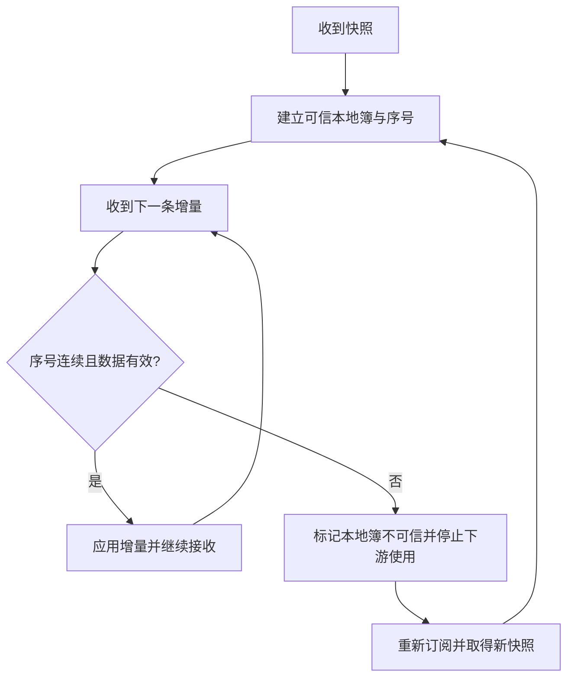
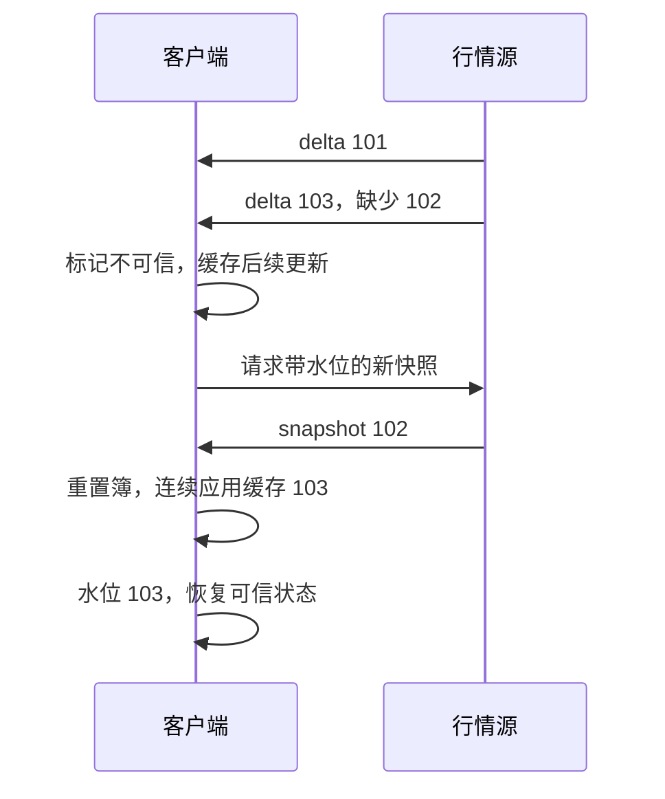

# 问题：本地簿看起来完整，可能已经错了

客户端通过 WebSocket（**WebSocket**）接收 BTC-USDT 订单簿增量（**delta/update**）：序号 100、101、103。页面仍能画出买卖盘，但缺少 102 后，本地数量已经不可信。若继续应用 103 之后的消息，错误会被伪装成“实时数据”。

重连本身不能证明数据连续。客户端需要一种办法识别缺口、丢弃不可信状态并重建。

# 发现：流式数据要说明它是快照还是变化

- **快照（snapshot）**描述某一时点的完整状态，适合建立基线。
- **增量（delta/update）**描述相对前一状态的变化，带宽低但依赖完整顺序。
- **成交事件**描述不可重复计数的交易事实，不能简单当成簿深度变化。
- **账户/订单事件**描述私有状态更新，不等于公共行情，也未必能独立重建全部存量状态。

协议要定义字段、序号（**sequence number**）、水位（**watermark**）、心跳（**heartbeat**）、过期和重新订阅行为。接口适配层将不同交易所协议标准化为内部事件类型，同时保留原始 payload 与来源序号，才能在规则变化时定位问题。

# 重建公共本地订单簿

通用客户端流程（不是任一交易所 API 的具体逐字协议）：

1. 建立连接并订阅指定产品/深度频道。
2. 按协议获取快照；将其标记为当前可信基线。
3. 对后续增量检查序号/前序号关系。只有连续的更新才应用。
4. 遇到缺口、协议不允许的序号倒退、非法数量或过期时间时，将本地簿标记为不可信。
5. 重新取快照，并按协议处理快照期间缓存的增量；不能简单把最新一条 delta 当成新快照。
6. 对下游标出数据新鲜度和连续性状态，避免把修复中的簿用于交易决策。

Bybit 支持增量的深度频道先发 snapshot，再发 delta；出现新 snapshot 时客户端应重置本地簿。线性、反向和现货的一档频道只有 snapshot，不能套用增量状态机。[Bybit Orderbook](https://bybit-exchange.github.io/docs/v5/websocket/public/orderbook) OKX 的变更日志要求特定增量频道用 `seqId/prevSeqId` 检查连续性，并明确旧 checksum 字段不再作为有效完整性校验。[OKX API Changelog](https://app.okx.com/docs-v5/log_en/)

# 私有事件流的恢复不完全相同

私有订单/成交流可能没有一个跨所有账户对象的全局序号，也可能只推发生变化的对象。客户端或内部网关通常要将实时事件与 REST 查询、订单/成交 ID 和账户快照结合起来：

- 保存最后应用的事件 ID/交易 ID/对象版本；
- 用唯一成交 ID 防止成交重复累计；
- 重连后查询活动订单和账户状态；
- 将查询响应与流事件在明确水位上合并；
- 如果无法确认某段事件是否已处理，重新读取权威状态并重建投影。

具体查询和排序保证是各家 API 的公开契约。Binance 在 2026 年公告中把 USDⓈ-M WebSocket 地址拆分成 public、market、private 类别；Bybit 提供单独的 public/private/trade WS 地址；OKX 的 private order channel 需要登录，且首次订阅不发送存量订单快照。REST API（**Representational State Transfer API**）可用于补查权威状态，但查询结果和实时流仍需按水位合并。[Binance WS Upgrade](https://www.binance.com/en/support/announcement/detail/ebf9b0aa9eca4ff3804eef6fb09ba32a) · [Bybit WS Connect](https://bybit-exchange.github.io/docs/v5/ws/connect) · [OKX API v5](https://app.okx.com/docs-v5/en/)

# 把“推送”理解成缓存更新通道

如果客户端把 WebSocket 当作永久、无丢失的真相，网络抖动会直接转化为错误账户展示。更稳妥的语义是：权威状态可查询，推送帮助低延迟增量更新；客户端保留消费水位，在不确定时回到可查询快照和对账。

在交易所内部，行情分发可能做采样、聚合、深度截断或降频。因此公开行情簿适合观察市场，不一定等于完整撮合订单簿。Bybit 的文档也注明某些订单类型不包含在该订单簿推送中。公开视图和撮合权威状态必须分开。

# 实验

## 手算一张会漏消息的本地簿

使用一个独立于 BTC 风险参数的简化市场，价格和数量都取整数。协议规定 delta 中数量是该档位的**新总量**；零表示删除，序号每次加一。真实接口须按自身序号协议实现。

| 消息 | 内容 |
|---|---|
| snapshot 100 | 买盘 `99 × 2`；卖盘 `101 × 3` |
| delta 101 | 卖价 101 数量设为 2 |
| delta 102 | 买价 99 数量设为 0 |
| delta 103 | 卖价 102 数量设为 4 |

### 第一步：先理解赋值与增减

收到 101 后，卖价 101 应为 2，而非 `3+2=5`。协议中的数量语义会决定本地簿更新算法；不能看到 delta 就假定每个字段都是增量加数。

### 第二步：漏掉 102 会留下什么？

假设客户端收到 100、101、103。先在纸上画簿，找出哪一个价格档位看起来仍存在。

展开缺口结果

若盲目应用 103，本地仍保留买盘 `99 × 2`，而权威簿已删除它。页面继续刷新会掩盖错误。客户端在看到 `103 ≠ 101+1` 时应标记不可信，并阻止依赖该簿的下游使用。缓存后续消息用于恢复与继续提供可信市场视图，是两个不同动作。

### 第三步：快照请求期间又来一条 delta

本教学协议允许取得带水位的 snapshot 102：买盘为空、卖盘 `101 × 2`。请求期间先到达的 delta 103 被暂存。新快照落地后，怎样连接它？

展开水位拼接

丢弃缓存中序号不大于 102 的更新；仅当接下来的缓存从 103 开始连续时才应用。于是最终本地簿为：买盘为空；卖盘 `101 × 2`、`102 × 4`，水位 103。若缓存第一条已是 104，缺口仍存在，应继续恢复，不能宣布同步完成。

这个过程不能直接移植成各家 REST/WS 的统一算法。有的协议使用区间序号，有的重新订阅后直接推新快照；共同要求是依据明确的水位规则证明基线与后续变化能够衔接。

完成 [流连续性实验](lab.md)，手动删除、重复和乱序增量，定义每种情况的恢复动作。

# 新问题：大量客户端同时重建，会不会压垮服务？

断线恢复往往形成流量尖峰：所有客户端同时请求快照、重新订阅私有流。系统还需要限流、背压、优先级和降级策略，确保行情故障不会拖垮订单和账户核心。下一章讨论过载。

# 掌握检查

- **回忆**：快照、增量、成交事件和私有账户事件分别能否独立重建完整状态？
- **推导**：收到序号 `100、101、103`，列出客户端的可信状态变化和必须执行的恢复动作。
- **应用**：快照生成期间又到达一批增量；设计缓冲与水位校验，避免把旧增量应用到新快照上。
- **重建**：从“网络连接不保证消息连续”推导序号、快照、缺口检测、重同步，以及公共簿与私有账户状态各自的权威来源。

# 从教学序号走向真实协议

先预测：水位是 10，下一条消息的 `prevSeqId=10, seqId=15`，是否缺了四条消息？

在 OKX 的 `books`、`books-l2-tbt` 和 `books50-l2-tbt` 增量协议中，应检查上一条水位与本条 `prevSeqId` 的衔接，而非要求 `seqId` 恰好加一。以下序列按官方规则构造：

| 消息 | prevSeqId | seqId | 客户端动作 |
|---|---:|---:|---|
| 初始快照 | -1 | 10 | 建立本地簿，水位设为 10 |
| 正常增量 | 10 | 15 | 前驱匹配，应用档位更新，水位设为 15 |
| 空买卖盘心跳 | 15 | 15 | 保持本地簿和水位；连接仍活跃 |
| 维护期间序号重置 | 15 | 3 | 前驱仍匹配，按协议应用更新，水位改为 3 |
| 重置后的增量 | 3 | 5 | 前驱匹配，继续更新 |
| 下一条异常增量 | 8 | 9 | 当前水位 5 与前驱 8 不匹配，停止应用并重建 |

因此，维护期间允许的序号回退不能直接当作旧消息丢弃。也不能只因看到较小序号就允许任意回退：仍须验证频道、产品、消息类型与前驱关系。连接切换时应隔离旧连接消息，避免混入新水位。

当前文档还明确：上述三个频道的 `checksum` 已弃用、固定为 0，不能用它证明订单簿正确。[OKX Order Book / Sequence ID](https://app.okx.com/docs-v5/en/#order-book-trading-market-data-ws-order-book-channel)

重建任务：用表中消息写出本地水位的变化，再插入一条来自旧连接的消息，说明怎样识别并隔离它。
