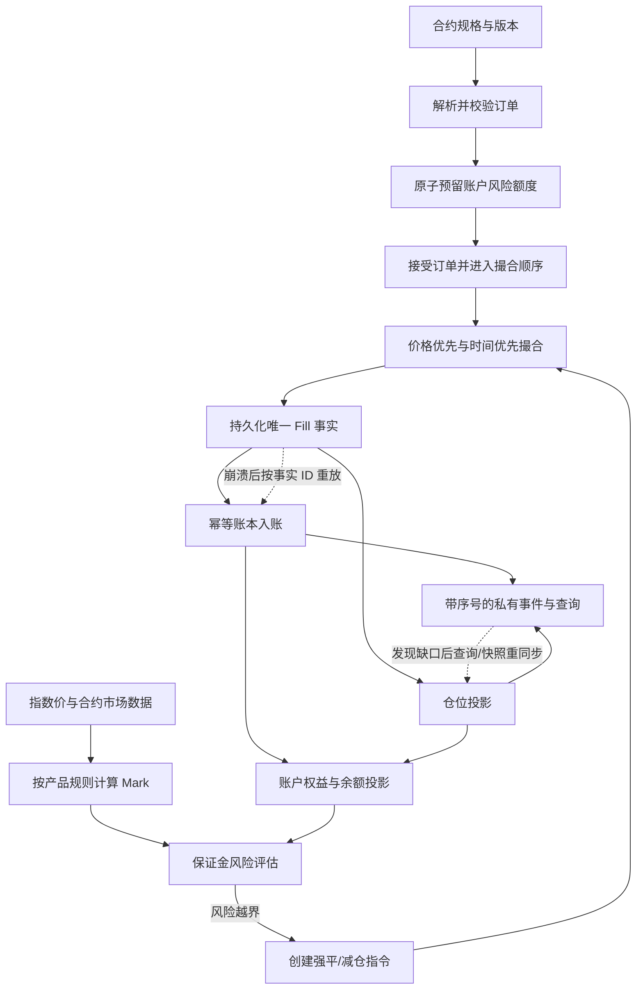

# 挑战：只给你一笔订单和一条风险要求

Alice 有 `1,000 USDT`，要在 BTC-USDT 线性永续市场买入 `0.01 BTC`，限价 `60,000 USDT/BTC`。交易所要按确定规则撮合、正确更新账户，并在损失扩大时管理风险。之后，某个服务可能崩溃，客户端也可能断线。

不看前十章，先试着画出这笔订单从请求到终态的路径。本章给出一份参考推导，再要求你改变条件、重新建模。目标不是复述模块名称，而是证明状态、金额、成交和风险在每个边界都有来源。

# 先冻结教学假设

为让每一步都能手算，本章设定如下。它们是人为选择的教学模型，不代表任何交易所的现行参数或内部实现：

| 项目 | 假设 |
|---|---|
| 合约 | BTC-USDT 线性永续，数量单位 BTC，结算币 USDT |
| 规格版本 | `spec-v17`，`tickSize=0.1`，`qtyStep=0.001` |
| 下单 | Alice 买入 `0.01 BTC`，限价 `60,000`，GTC |
| 撮合簿 | 先有 `0.004 BTC @ 59,999`，再有 `0.006 BTC @ 60,000` 的卖单 |
| 保证金 | 为演示预留与计算，初始保证金率 10%，Alice 逐仓分配 60 USDT |
| 维持要求 | 固定 0.5%，忽略档位、费用、资金费、舍入与其他仓位 |
| 价格 | Last 用于展示；简化风险模型按 Mark 计算未实现盈亏 |

先列假设可以避免把算例误当成交易所规则。真实产品必须分别核对账户模式、订单类型、费率、风险档位、精度与强平语义。

# 按一笔委托逐步推导系统

## 第 1 步：用产品规格解释输入

`0.01 BTC` 符合 `0.001 BTC` 的数量步长，`60,000` 符合 `0.1` 的价格刻度。撮合内部可把数量转成 `10 lots`，价格转成 `600,000 ticks`。若客户端重复提交相同的幂等键，系统应返回同一订单结果，而不是新建第二笔委托。

名义价值为：

```text
0.01 BTC × 60,000 USDT/BTC = 600 USDT
```

单位约掉后是 USDT。若价格或数量不能整除规格刻度，应在接受前拒绝，并返回具体原因。

## 第 2 步：先预留风险，再承诺接受

按本章的 10% 示意保证金率，订单全部成交需要预留 `600 × 10% = 60 USDT`。在风险范围内原子预留这 60 USDT 后，订单才进入 `ACCEPTED`。这只是模型中的预留规则；现实系统可能另计手续费缓冲、已有挂单、组合风险、抵押品折扣和风险档位。

接受确认表示服务端已经接受命令并能恢复其状态；它不表示成交已经发生。订单数量必须始终满足：

```text
原始数量 = 累计成交数量 + 剩余数量
0.01 BTC = 0 BTC + 0.01 BTC
```

## 第 3 步：逐档撮合并保留成交事实

订单簿按价格优先、同价时间优先处理：

| 轮次 | 最优卖单 | 成交量 | 成交后剩余买量 |
|---|---|---:|---:|
| 1 | `0.004 @ 59,999` | `0.004 BTC @ 59,999` | `0.006 BTC` |
| 2 | `0.006 @ 60,000` | `0.006 BTC @ 60,000` | `0 BTC` |

两笔 Fill 有独立唯一 ID。加权平均成交价为：

```text
(0.004 × 59,999 + 0.006 × 60,000) / 0.01 = 59,999.6 USDT/BTC
```

订单状态从 `ACCEPTED` 到部分成交，再到 `FILLED`；每轮都能检查累计成交量与剩余量之和等于原始数量。订单簿移除已成交委托，不会删除 Fill 事实。

## 第 4 步：从 Fill 更新账本和仓位

两笔 Fill 以各自 `fill_id` 进入账本消费。Alice 的仓位投影变成多头 `0.01 BTC`，平均入场价 `59,999.6`。重复收到同一 Fill 时，账本按业务幂等键只应用一次；仓位是由已处理事实计算出的投影，不是独立真相。

初始保证金占用仍按本模型为 `60 USDT`。它是风险限制，不等于把 `600 USDT` 名义价值转给对手方。账户钱包、已实现盈亏、未实现盈亏、占用保证金和可用余额分别记录。

## 第 5 步：用 Mark 而非局部成交检查风险

假设 Mark 从开仓价跌到 `54,000`：

```text
未实现盈亏 = 0.01 × (54,000 - 59,999.6) = -59.996 USDT
逐仓权益   = 60 - 59.996 = 0.004 USDT
维持要求   = 0.01 × 54,000 × 0.5% = 0.27 USDT
```

因为 `0.004 ≤ 0.27`，本章简化模型触发风险处置。Last 仍用于呈现最近成交；Mark 是按产品规则构造的风险参考值。真实强平条件往往还涉及阶梯档位、费用、资金费和账户组合风险，不能把这条示例公式当作通用公式。

## 第 6 步：强平执行价产生实际损益

假设风险服务创建唯一 `liquidation_id`，清算卖单最终在 `53,950` 完全成交：

```text
实际平仓盈亏 = 0.01 × (53,950 - 59,999.6) = -60.496 USDT
模型内可用逐仓保证金 = 60 USDT
简化缺口 = 0.496 USDT
```

强平触发所用的 Mark、破产价和市场实际执行价是不同值。成交事实和账户入账先确定，再依产品规则处理剩余缺口；本例只说明为什么需要保险基金或其他缺口规则，并不推断某一家交易所的实际处置顺序。

## 第 7 步：把重启和断线放进同一条路径

再注入两个故障：Fill 已持久化，但账本提交后进程崩溃；Alice 的行情连接收到序号 `100、101、103`，漏了 `102`。

1. 账本从最后确认的消费序号恢复，以 Fill ID 幂等重放；已提交的记录不会再记第二次。
2. 账户仓位投影从权威成交/账本事实重建，并与余额快照对账。
3. 行情客户端发现序号缺口后，把本地簿标为不可信，重新获取快照并按协议接上后续增量。
4. 私有订单和成交状态可通过权威查询及带游标的事件恢复；不能用公共订单簿推断 Alice 的账户状态。

# 全链路图：事实从哪里来，下一步依赖什么



这是一条逻辑依赖图，不是服务部署图。实现可以合并或拆分服务，但不能抹掉订单接受、成交事实、账本入账和风险处置之间的确认边界。

# 最终实验：改变条件，检查模型是否仍闭合

完成[端到端重建实验](lab.md)。你将改动订单类型、成交顺序、账户模式、Mark、故障位置和流量负载；每次变化都要说明哪个状态/公式改变、哪个不变量仍必须成立。

# 掌握检查

- **回忆**：按顺序说出从合约规格到事件恢复的核心状态/事实，并区分 Mark、Last、Fill 与仓位投影。
- **推导**：不看本章，独立重算两笔成交的加权均价、Mark=`54,000` 时的未实现盈亏/权益/维持要求，以及执行在 `53,950` 时的损益和缺口。
- **应用**：把第二笔卖盘改为 `0.003 BTC @ 60,000`，重算订单剩余量，说明 GTC 订单如何处理余量，并更新风险预留。
- **重建**：给出一张从订单请求、接受、成交、账本、风险、强平、故障恢复到客户端重同步的图；再任选一处注入重复消息或崩溃，沿唯一事实推导恢复结果。

## 交卷标准

不看前文，从初始资金和产品规格开始，独立画出端到端路径，并满足以下检查：

1. 每个数量与价格都带单位、规格版本和精度解释。
2. 每个接受、拒绝、成交、撤单和强平结果都有唯一业务事实或明确状态来源。
3. 订单数量守恒，Fill 不重复入账，账本可按事实恢复。
4. 价格估值、保证金占用和钱包现金变化没有混为一谈。
5. Mark 触发、破产边界和实际成交结果分别建模。
6. 崩溃、重复消息、序号缺口和过载都有恢复/拒绝路径。
7. 公开交易所行为有一手来源；未公开的内部实现清楚标注为教学参考设计。

能背出模块名称只是回忆。能算数、解释边界、改变参数后继续推导，才说明你重建了这套系统。
